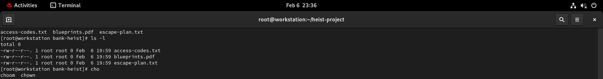
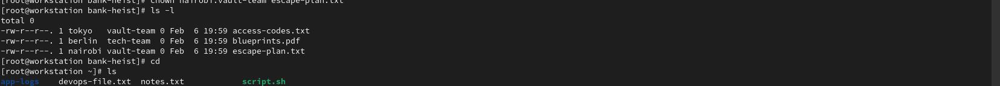

# Day 11 Challenge

## Files & Directories Created
- -rw-r--r--. 1 tokyo   vault-team 0 Feb  6 19:59 access-codes.txt
- -rw-r--r--. 1 berlin  tech-team  0 Feb  6 19:59 blueprints.pdf
- -rw-r--r--. 1 nairobi vault-team 0 Feb  6 19:59 escape-plan.txt
- -rw-r--r--. 1 professor heist-team  0 Feb  6 19:48 project-config.yaml
- -r--r--r--. 1 berlin    root       25 Feb  6 19:30 devops-file.txt
- drwxr-xr-x. 2 berlin    heist-team  6 Feb  6 19:49 app-logs
- drwxr-xr-x. 2 root      root       75 Feb  6 19:59 bank-heist
- -r--r--r--. 1 berlin    root       25 Feb  6 19:30 devops-file.txt
- drwxr-xr-x. 4 professor planners   32 Feb  6 19:53 heist-project
- drwxr-xr-x. 2 professor planners 27 Feb  6 19:54 plans
drwxr-xr-x. 2 professor planners 22 Feb  6 19:53 vault
---
## Ownership Changes
## [before]
- rw-r--r--. 1 root root 0 Feb  6 19:59 access-codes.txt
- -rw-r--r--. 1 root root 0 Feb  6 19:59 blueprints.pdf
- -rw-r--r--. 1 root root 0 Feb  6 19:59 escape-plan.txt
- 
## Ownership Changes

### Before changing ownership


## [After]
- -rw-r--r--. 1 tokyo   vault-team 0 Feb  6 19:59 access-codes.txt
- -rw-r--r--. 1 berlin  tech-team  0 Feb  6 19:59 blueprints.pdf
- -rw-r--r--. 1 nairobi vault-team 0 Feb  6 19:59 escape-plan.txt
### After changing ownership



Example:
- devops-file.txt: user:user → tokyo:heist-team
---
## Commands Used
```bash
echo "this is devops.txt file " > devops.txt # for create file 
ls -l devops.txt #   Lists files and directories in long format, showing permissions, number of links, owner, group, size, and last modified date.

chown tokyo devops.txt #   Changes the owner of a file to the specified user. Superuser privileges are required to modify file ownership.

groupadd heist-team.txt # For create group
chgrp team-notes.txt #  Changes the group ownership of a file to the specified group.
chown professor:heist-team project-config.yaml # For change ownership user and group both in singal command
chown -R professor:planners heist-project/#   Recursively changes the owner and group of a directory and all files and subdirectories inside it.
 
```
---
## What I Learned


In this lab, I learned how file ownership and group permissions work in Linux and how to manage them using the `ls`, `chown`, and `chgrp` commands. I learned that every file in Linux has an **owner** (the user who owns the file) and a **group** (a set of users who can share access to the file). By using `ls -l`, I was able to identify the owner and group columns and understand how file permissions are displayed.

I practiced changing file ownership using the `chown` command and learned that superuser privileges (`sudo`) are required to modify file owners. I also learned how to change only the group ownership with `chgrp`, as well as how to change both the owner and group at the same time using the `owner:group` syntax. Creating users and groups helped me understand how Linux organizes access for teams.

Additionally, I learned how to apply ownership changes recursively to entire directories using the `-R` flag, ensuring that all files and subdirectories inherit the correct owner and group. The practice challenge reinforced these skills by assigning different users and groups to files, simulating real-world scenarios where proper access control is essential for security and collaboration.
## File Ownership Output


