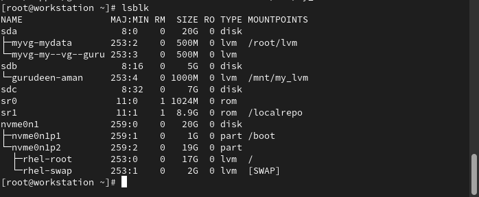
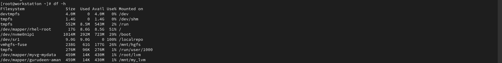
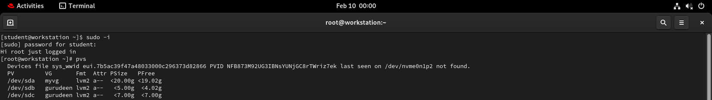
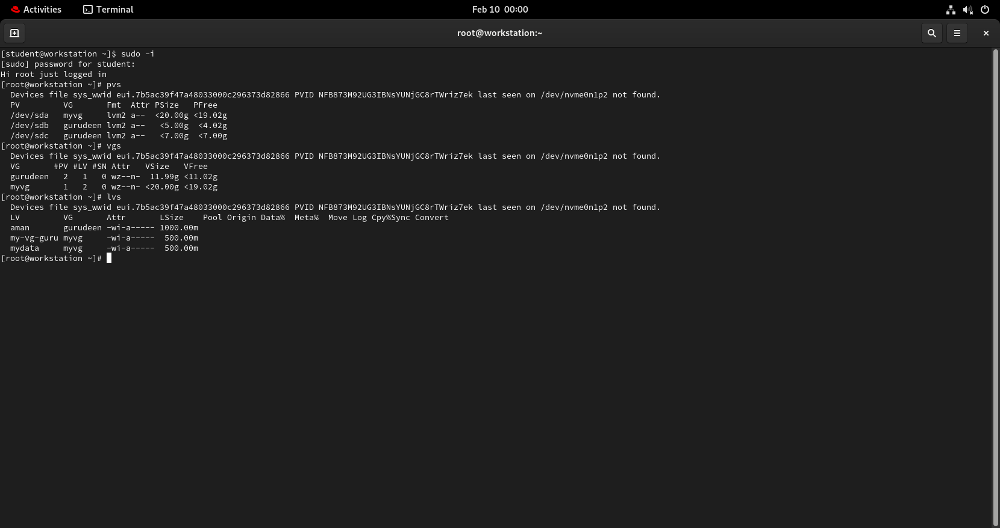

#  Task 1: Check Current Storage
---
Run: 
-` lsblk`

- `pvs`
-  `vgs`
-  `lvs`
-  `df -h`
-  


# Task 2: Create Physical Volume
```bash
pvcreate /dev/sdb   # or your loop device
pvs
```

# Task 3: Create Volume Group
```bash
vgcreate gurudeen_vg /dev/sdb /dev/sdc
vgs
```

# Task 4: Create Logical Volume
```
lvcreate -L 500M -n aman gurudeen_vg
lvs
```

# Task 5: Format and Mount
```bash
mkfs.ext4 /dev/gurudeen/aman 
mkdir -p /mnt/my_lvm
mount /dev/gurudeen/aman /mnt/my_lvm
df -h /mnt/my_lvm

```
# Task 6: Extend the Volume
```bash 
lvextend -L +200M /dev/gurudeen/aman
df -h /mnt/my_lvm
```
