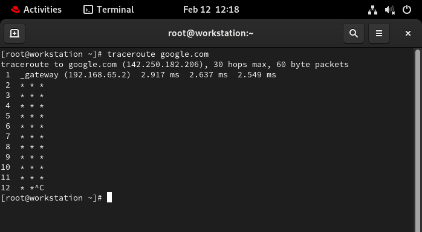
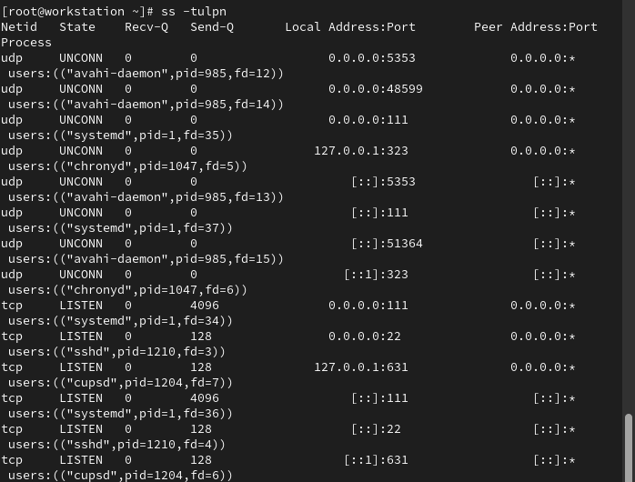
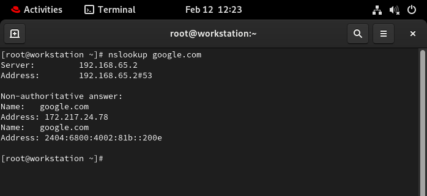

# OSI vs TCP/IP Model – Side-by-Side Mapping

## Clean Mapping Table

| OSI Model (7 Layers) | TCP/IP Model (4 Layers) | What It Actually Means |
|----------------------|--------------------------|------------------------|
| 7. Application       |                          |                        |
| 6. Presentation      | Application Layer        | Everything above transport |
| 5. Session           |                          |                        |
| 4. Transport         | Transport Layer          | End-to-end communication |
| 3. Network           | Internet Layer           | IP routing |
| 2. Data Link         |                          |                        |
| 1. Physical          | Network Access Layer     | Hardware + local network |

---

## Layer Mapping Summary


### TCP/IP Application Layer
Includes:
- OSI Layer 7 (Application)
- OSI Layer 6 (Presentation)
- OSI Layer 5 (Session)

Handles:
- HTTP / HTTPS
- DNS
- FTP
- SMTP
- TLS
- APIs
- Data formatting

---

### TCP/IP Transport Layer
Includes:
- OSI Layer 4 (Transport)

Handles:
- TCP
- UDP
- Ports
- End-to-end communication
- Reliability and retransmissions

---

### TCP/IP Internet Layer
Includes:
- OSI Layer 3 (Network)

Handles:
- IP addressing
- Routing
- Packet forwarding

---

### TCP/IP Network Access Layer
Includes:
- OSI Layer 2 (Data Link)
- OSI Layer 1 (Physical)

Handles:
- Ethernet
- MAC addressing
- Switching
- Physical hardware connectivity
- 
# 🛠 Hands-on Networking Checklist

> 📌 Choose ONE target service/host (e.g., `google.com`, your lab server, or a local service).  
> Use the same target for `ping`, `traceroute`, and `curl` where possible.


Here’s a mini network check template + example output you can use for a target host/service.

I’ll use:
🎯 Target: google.com

You can replace it with your lab server or internal service.
---

# 🔎 Target Used

---

# 1️⃣ Identity

## Command
```bash
hostname -I
```
## output 


# Observation (1–2 lines)

# 2️⃣ Reachability
Command

ping -c 4 google.com 

Output


# 3️⃣ Path (Routing Visibility)
Command
---
traceroute google.com
# output 

---
# 4️⃣ Ports (Listening Services)
Command

ss -tulpn
# output

# 5️⃣ Name Resolution

Command

nslookup google.com

Output


