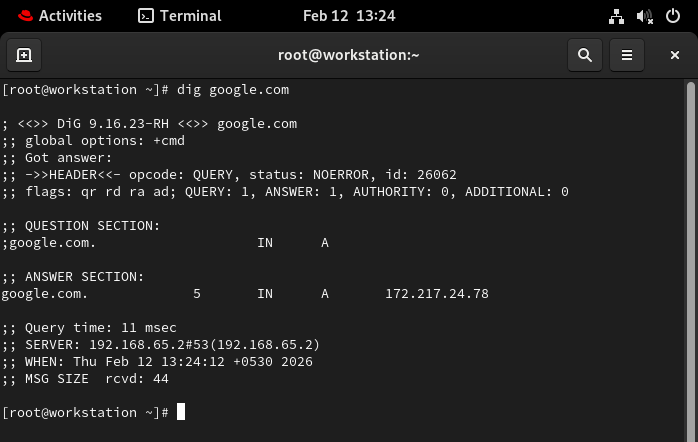
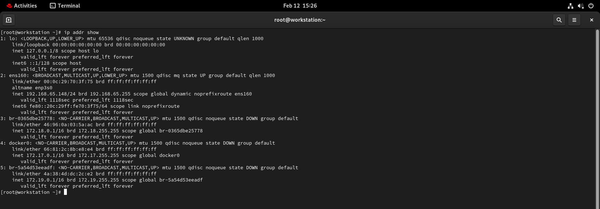
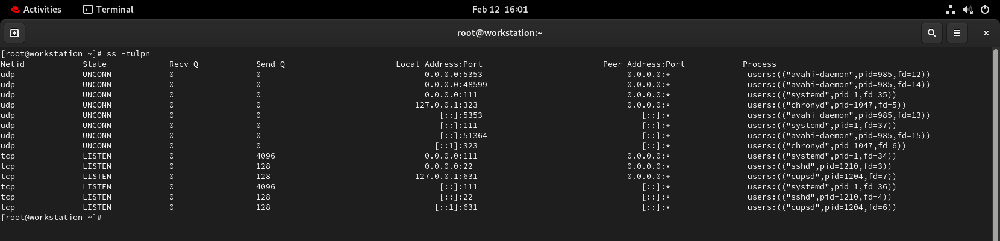

# Challenge Tasks
#  Task 1: DNS – How Names Become IPs
# 1. Explain in 3–4 lines: what happens when you type google.com in a browser?
the browser first checks the DNS to resolve the domain name into an IP address. Once it gets the IP, it establishes a TCP connection `(usually over port 443 for HTTPS)` with Google’s server. The browser then sends an HTTP request, the server responds with the webpage data, and finally, the browser renders the content for you to see. All of this happens in milliseconds.

When you type `google.com` in a browser, your computer first asks a DNS server to find the IP address of Google. Then, your browser connects to that IP using HTTP/HTTPS and requests the webpage. Google’s server sends back the data, and finally, your browser displays the page on your screen.

---

# 2. What are these record types? Write one line each: `A, AAAA, CNAME, MX, NS`

This document provides common DNS record types with real-world examples and their explanations.

---

| Record  | Example                              | Explanation |
|---------|--------------------------------------|-------------|
| **A**   | example.com → 93.184.216.34          | The domain `example.com` points to the IPv4 address `93.184.216.34`. |
| **AAAA**| example.com → 2606:2800:220:1:248:1893:25c8:1946 | The domain points to an IPv6 address for modern networks. |
| **CNAME** | www.example.com → example.com       | The `www` version is an alias of the main domain. |
| **MX**  | example.com → mail.example.com       | Emails sent to `user@example.com` are handled by `mail.example.com`. |
| **NS**  | example.com → ns1.cloudflare.com     | `ns1.cloudflare.com` is the name server managing DNS for `example.com`. |

---

- `**A / AAAA**` → Map domains to IP addresses (IPv4 / IPv6)  
- `**CNAME**` → Provides an alias to another domain  
- `**MX**` → Directs email to the correct mail server  
- `**NS**` → Specifies which server manages the domain's DNS records  

This table provides a simple reference for understanding how DNS records are used in the real world.

---
# 3 :Run: dig google.com — identify the A record and TTL from the output

- A record →  `172.217.24.78`

This is the IPv4 address for `google.com`.
- TTL →  `5` second 
-  TTL (Time To Live) tells how long this record is cached by DNS resolvers before querying again.
-  
---

# task 2 : 

# 1. What is an IPv4 address? How is it structured? (e.g., 192.168.1.10)

####  What is an IPv4 Address?

An IPv4 address is a unique numerical identifier assigned to each device connected to a network that uses the Internet Protocol version 4 (IPv4). It allows devices—like computers, smartphones, or servers—to communicate with each other over a network, including the Internet.

 `In simple terms, it’s like a home address for your device on a network, telling data where to go and where it came from.`
    
 ####  Structure of an IPv4 Address
 
An IPv4 address consists of 32 bits, which are divided into four 8-bit sections called octets or bytes. 
Dotted-Decimal Notation: For human readability, the 32-bit binary number is converted into four decimal numbers, each ranging from 0 to 255, separated by periods or dots .
Example (192.168.1.10):
192 (Octet 1)
168 (Octet 2)
1 (Octet 3)
10 (Octet 4)
Range: Each octet is 8 bits, allowing for a value from 0 to 255 This enables a total of approximately 4.3 billion unique addresses 
#### 2. Difference between public and private IPs — give one example of each

# public IP Address 
Public IP addresses are globally unique identifiers assigned by ISPs to identify devices on the internet, whereas private IPs are used for local, internal network communication (e.g., home/office) and are not directly accessible from the internet

# private IP Address
 while private IPs are managed by routers, offering security and internal, non-unique addressing. 
 # 🌐 Private vs Public IP Address

This document explains the differences between **Private** and **Public** IP addresses with examples.

---

| Feature | Private IP Address | Public IP Address |
|---------|------------------|-----------------|
| **Usage** | Used within a local or private network | Used for communication over the Internet |
| **Routability** | Not routable on the public Internet | Routable on the public Internet |
| **Scope** | Limited to the local network | Global |
| **Assignment** | Assigned by router or DHCP server | Assigned by ISP |
| **Uniqueness** | Unique within a local network | Globally unique |
| **NAT Requirement** | Requires NAT for Internet access | Does not require NAT |
| **Visibility** | Hidden from external networks | Visible on the Internet |
| **IP Range** | Uses reserved private IP ranges | Uses globally assigned IP ranges |
| **Cost** | Freely usable inside networks | May involve additional ISP cost |
| **Example** | 192.168.1.10 | 203.0.113.10 |

---

## ✅ Summary

- **Private IPs** are for **internal network use** and are not accessible from the Internet.  
- **Public IPs** are for **external communication** and are globally reachable.  
- NAT (Network Address Translation) is often used to allow private IPs to access the Internet using a public IP.  
- 
#### 2. What are the private IP ranges? `10.x.x.x`, `172.16.x.x – 172.31.x.x`, `192.168.x.x`

Private IP ranges are reserved by IANA for internal networking, ensuring they are not routed on the public internet. The three main ranges are:
Class A (10.0.0.0 – 10.255.255.255),
Class B (172.16.0.0 – 172.31.255.255),
Class C (192.168.0.0 – 192.168.255.255). These allow for local, non-unique device identification. 

Key Private IP Address Details
Class A (10.0.0.0/8): to (over 16 million addresses).
Class B (172.16.0.0/12): to (over 1 million addresses).
Class C (192.168.0.0/16): to (65,536 addresses).

These ranges are commonly used in home networks, office LANs, and corporate environments. They are not unique to any single organization and are reused across different networks, relying on Network Address Translation (NAT) to access the internet. 

Run: ip addr show — identify which of your IPs are private

---

# Task 3: CIDR & Subnetting

#   What does /24 mean in 192.168.1.0/24
    The /24 is called a CIDR notation and it represents the subnet mask of the network.

Specifically, /24 means:

- The first 24 bits of the IP address are used for the network portion.

- The remaining 8 bits (32 − 24) are used for host addresses
# What It Means for 192.168.1.0/24

- Network address: 192.168.1.0

- Subnet mask: 255.255.255.0

- Usable host range: 192.168.1.1 – 192.168.1.254

- Broadcast address: 192.168.1.255

- Total IPs: 256

- Usable devices: 254
- 
# Usable Hosts in IPv4 Subnets (/24, /16, /28)

In IPv4 subnetting, the number of usable hosts is calculated by formula:
**$2^{\text{host bits}} - 2$**

We subtract 2 because the first address (all 0s) is the Network Address, and the last address (all 1s) is the Broadcast Address, which cannot be assigned to individual devices.

### 1. How many usable hosts in a /24?
*   **Total IP Addresses:** $2^{(32-24)} = 2^8 = 256$
*   **Usable Hosts:** $256 - 2 = \mathbf{254}$
*   **Subnet Mask:** 255.255.255.0

### 2. How many usable hosts in a /16?
*   **Total IP Addresses:** $2^{(32-16)} = 2^{16} = 65,536$
*   **Usable Hosts:** $65,536 - 2 = \mathbf{65,534}$
*   **Subnet Mask:** 255.255.0.0

### 3. How many usable hosts in a /28?
*   **Total IP Addresses:** $2^{(32-28)} = 2^4 = 16$
*   **Usable Hosts:** $16 - 2 = \mathbf{14}$
*   **Subnet Mask:** 255.255.255.240

---

### Summary Table

| CIDR | Subnet Mask | Total IPs | Usable Hosts ($2^h-2$) |
| :--- | :--- | :--- | :--- |
| **/16** | 255.255.0.0 | 65,536 | **65,534** |
| **/24** | 255.255.255.0 | 256 | **254** |
| **/28** | 255.255.255.240 | 16 | **14** |

---

### Quick Reference Notes
*   **Host bits ($h$):** $32 - \text{CIDR}$. Example for /28: $32-28=4$ host bits.
*   **/31 Subnets:** Used for point-to-point links (2 hosts), where the -2 rule does not apply (2 total, 2 usable).
*   **/32 Subnets:** Represents a single host (1 usable).
---

# 🌐 CIDR Subnetting Exercise

## Quick Exercise — Fill In

| CIDR | Subnet Mask       | Total IPs | Usable Hosts |
|------|------------------|-----------|--------------|
| /24  | 255.255.255.0    | 256       | 254          |
| /16  | 255.255.0.0      | 65,536    | 65,534       |
| /28  | 255.255.255.240  | 16        | 14           |

---

## 📌 Formula Reference

- **Total IPs** = 2^(32 − CIDR)
- **Usable Hosts** = Total IPs − 2  
  (Subtract 1 for Network Address and 1 for Broadcast Address)

---

## 🧠 Example Calculation

### /24
- Host bits = 32 − 24 = 8  
- Total IPs = 2^8 = 256  
- Usable Hosts = 256 − 2 = 254  

### /16
- Host bits = 32 − 16 = 16  
- Total IPs = 2^16 = 65,536  
- Usable Hosts = 65,536 − 2 = 65,534  

### /28
- Host bits = 32 − 28 = 4  
- Total IPs = 2^4 = 16  
- Usable Hosts = 16 − 2 = 14  

---

## ✅ Summary

- /24 → 254 usable hosts  
- /16 → 65,534 usable hosts  
- /28 → 14 usable hosts  

Perfect for quick subnetting revision.

---

# Task 4: Ports – The Doors to Services

# What is a port? Why do we need them
They are essential to allow multiple services (like web browsing on port 443 and email on port 25) to run simultaneously without interfering. 

# Why Do We Need Ports?
- Application Differentiation: Ports ensure incoming data reaches the correct application, distinguishing between web, email, or file transfer traffic.
- Multiplexing: They enable a single computer with one IP address to manage multiple, simultaneous network connections.
- Security Control: Firewalls and network administrators use ports to control access to specific services by blocking or allowing traffic on certain numbers.
- Organized Communication: They act as logical endpoints in TCP/IP networking, directing data packets from the network interface to the specific software proce
- 
# Document these common ports:
# 🌐 Common Network Ports

This document lists commonly used network ports and their associated services.

---

| Port  | Service |
|--------|----------|
| 22     | SSH (Secure Shell) |
| 80     | HTTP (HyperText Transfer Protocol) |
| 443    | HTTPS (HTTP Secure) |
| 53     | DNS (Domain Name System) |
| 3306   | MySQL Database |
| 6379   | Redis |
| 27017  | MongoDB |

---

## 📌 Brief Description of Each

### 22 – SSH
Used for secure remote login and server administration.

### 80 – HTTP
Used for standard web traffic (unencrypted).

### 443 – HTTPS
Used for secure, encrypted web traffic using SSL/TLS.

### 53 – DNS
Used for domain name resolution (UDP and sometimes TCP).

### 3306 – MySQL
Default port for MySQL database connections.

### 6379 – Redis
Default port for Redis in-memory data store.

### 27017 – MongoDB
Default port for MongoDB database connections.

---

## ✅ Summary

These ports are commonly seen in:
- Web servers
- Cloud environments
- DevOps infrastructure
- Database systems

Understanding them is essential for networking, firewall rules, and troubleshooting.

# Run ss -tulpn — match at least 2 listening ports to their services

