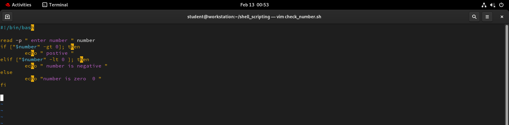
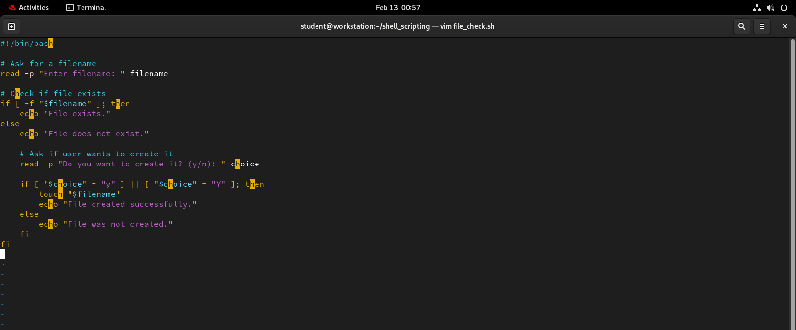
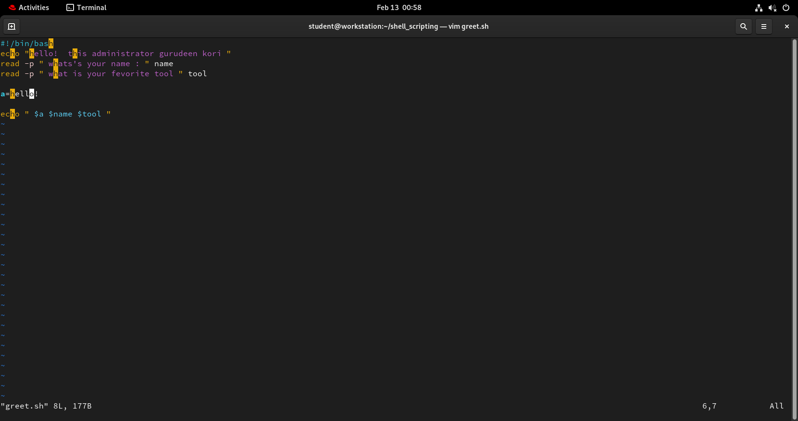
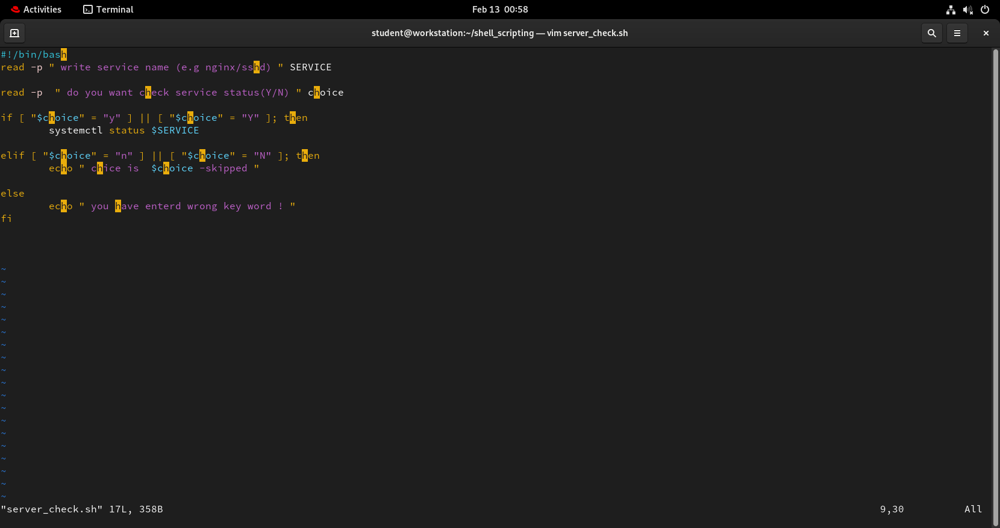
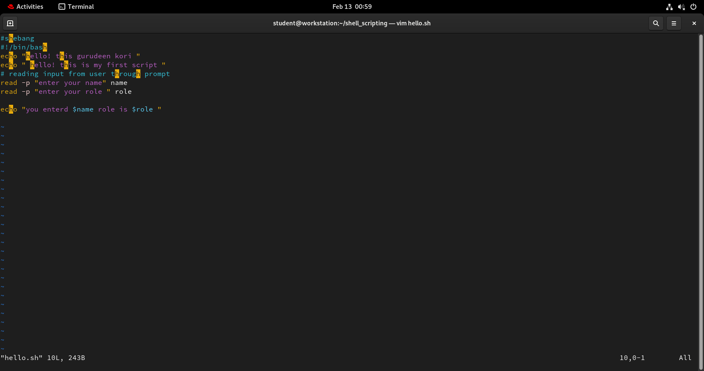

#  1. vim check_number.sh 
```bash 
#!/bin/bash

read -p " enter number " number
if ["$number" -gt 0]; then
        echo " postive "
elif ["$number" -lt 0 ]; then
        echo " number is negative "
else
        echo "number is zero  0 "
fi
```
# output 



---
# 2. vim check.sh 
```bash
#!/bin/bash

# Ask for a filename
read -p "Enter filename: " filename

# Check if file exists
if [ -f "$filename" ]; then
    echo "File exists."
else
    echo "File does not exist."

    # Ask if user wants to create it
    read -p "Do you want to create it? (y/n): " choice

    if [ "$choice" = "y" ] || [ "$choice" = "Y" ]; then
        touch "$filename"
        echo "File created successfully."
    else
        echo "File was not created."
    fi
fi
```
# output


---
# 3. vim greet.sh 

```bash
 #!/bin/bash
echo "hello!  this administrator gurudeen kori "
read -p " whats's your name : " name
read -p " what is your fevorite tool " tool

a=hello!

echo " $a $name $tool "
~                   
```

---

# 4.  vim server_check.sh 
```bash 
#!/bin/bash
read -p " write service name (e.g nginx/sshd) " SERVICE

read -p  " do you want check service status(Y/N) " choice

if [ "$choice" = "y" ] || [ "$choice" = "Y" ]; then
        systemctl status $SERVICE

elif [ "$choice" = "n" ] || [ "$choice" = "N" ]; then
        echo " chice is  $choice -skipped "

else
        echo " you have enterd wrong key word ! "
fi
```
# output 

# 5. vim hello.sh
```bash 
#shebang
#!/bin/bash 
echo "hello! this gurudeen kori "
echo " hello! this is my first script "
# reading input from user through prompt 
read -p "enter your name" name
read -p "enter your role " role

echo "you enterd $name role is $role "
```
# output 


---

Understand shebang (#!/bin/bash) and why it matters
Working with variables, echo, and read
 basic if-else conditions
 

