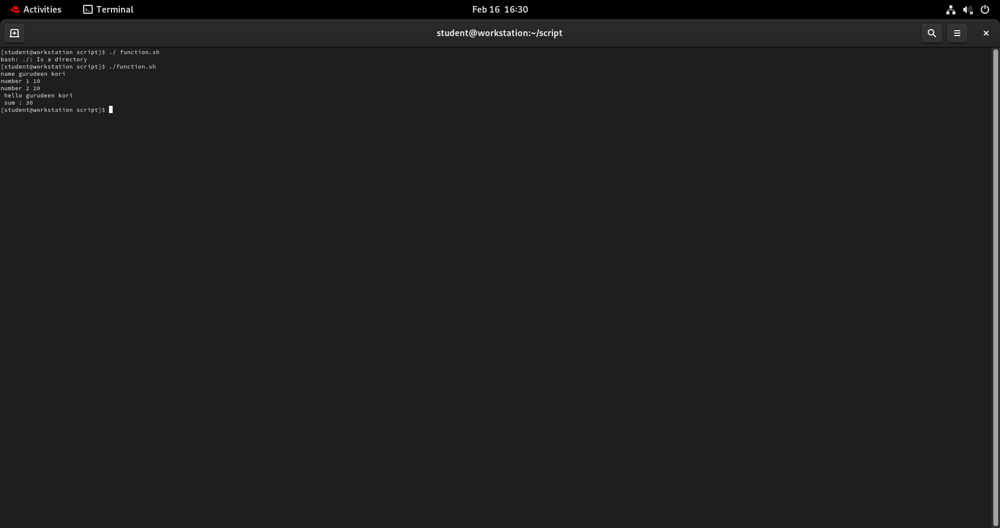
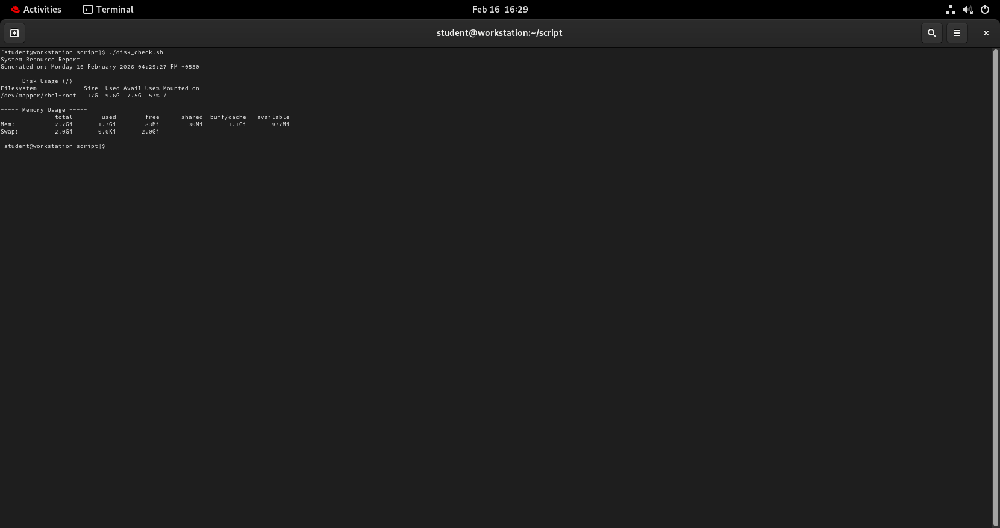
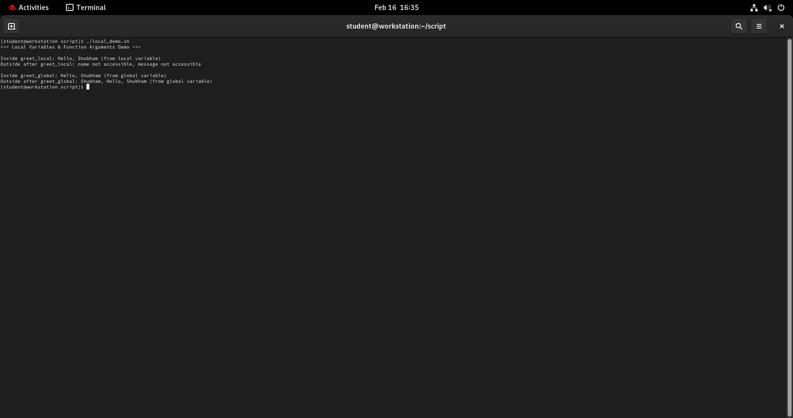
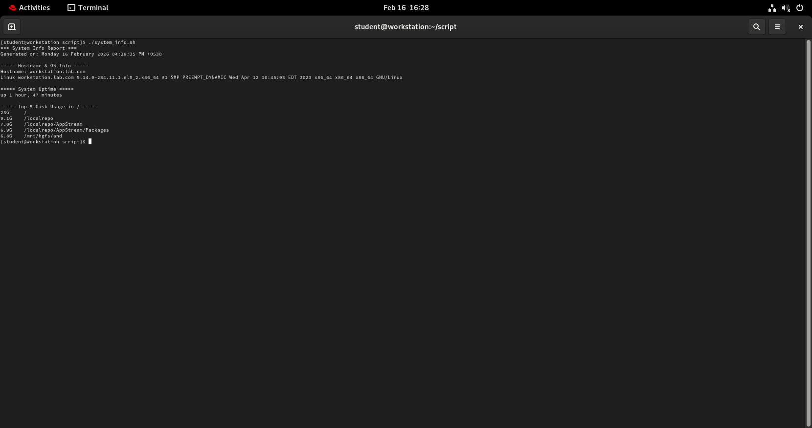

# function.sh
```bash
#!/bin/bash 

greet () {
        name="$np"
        echo " hello $name "
}

add(){
        num1="$1"
        num2="$2"
        sum=$((num1+num2))
        echo " sum : $sum "
}
read -p "name" np
read -p "number 1 " num1
read -p "number 2" num2
greet "$np"
add "$num1" "$num2"
```
# output


# disk_check.sh
```bash 
#!/bin/bash


check_disk() {
    echo "----- Disk Usage (/) ----"
    df -h /
    echo
}

check_memory() {
    echo "----- Memory Usage -----"
    free -h
    echo
}

echo "System Resource Report"
echo "Generated on: $(date)"
echo

check_disk
check_memory
```
output



# local_variable 
```bash
#!/bin/bash

echo "=== Local Variables & Function Arguments Demo ==="
echo

# Function using local variable and argument
greet_local() {
    local name="$1"   # $1 is the argument passed to function
    local message="Hello, $name (from local variable)"
    echo "Inside greet_local: $message"
}

# Function using global variable and argument
greet_global() {
    name="$1"          # global variable
    message="Hello, $name (from global variable)"
    echo "Inside greet_global: $message"
}

# --- Main Section ---

# Call function with local variable
greet_local "Shubham"

# Try accessing variables outside the function
echo "Outside after greet_local: ${name:-name not accessible}, ${message:-message not accessible}"
echo

# Call function with global variable
greet_global "Shubham"

# Access variables outside the function
echo "Outside after greet_global: $name, $message"

```
output


# system_info.sh

```bash
##!/bin/bash
set -euo pipefail

# === Functions ===

# Function: Hostname and OS info
print_host_os() {
    echo "===== Hostname & OS Info ====="
    echo "Hostname: $(hostname)"
    if command -v lsb_release >/dev/null 2>&1; then
        lsb_release -a
    else
        uname -a
    fi
    echo
}
system_info.sh
# Function: Uptime
print_uptime() {
    echo "===== System Uptime ====="
    uptime -p
    echo
}

# Function: Disk usage (top 5 largest directories in /)
print_disk_usage() {
    echo "===== Top 5 Disk Usage in / ====="
    du -h / 2>/dev/null | sort -hr | head -n 5
    echo
}

# Function: Memory usage
print_memory_usage() {
    echo "===== Memory Usage ====="
    free -h
    echo
}

# Function: Top 5 CPU-consuming processes
print_top_cpu() {
    echo "===== Top 5 CPU-Consuming Processes ====="
    ps -eo pid,comm,%cpu --sort=-%cpu | head -n 6
    echo
}

# === Main Function ===
main() {
    echo "=== System Info Report ==="
    echo "Generated on: $(date)"
    echo

    print_host_os
    print_uptime
    print_disk_usage
    print_memory_usage
    print_top_cpu
}

# Call main
main
```
output



---
- today i have enhanced shell scripting skills like functions in shell scripting.
-  what is function,its declaration and call the fuction  
- view disk information through shell script and commands
- system  reports like os name, uptime,disk uasage ,memory usage and cpu through scripting  


