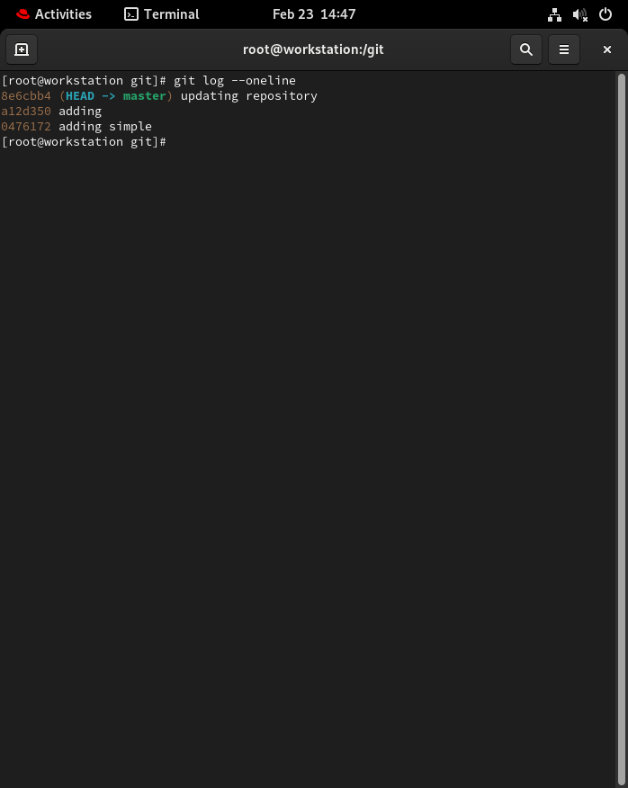

# 🛠️ Task 1: Install and Configure Git

## Step 1: Verify Git is Installed

Open your terminal or command prompt and run:
```bash
git --version
```
---

# Step 2: Set up your Git identity — name and email
```bash
git config --global user.name "gurudeen-kori"
git config --global user.mail "gurudeenkori2003@gmail.com"
```

# Step 3: Verify Your Configuration
```bash
git config --global --list
```
# Task 2: Create Your Git Project
# 1. Create a new folder called devops-git-practice
```bash 
mkdir devops-git-practice 
```
# 2. Initialize it as a Git repository
```bash 
git init 
```
# 3. Check the status — read and understand what Git is telling you
```bash
git status
```
---
- On branch main

- No commits yet

- nothing to commit (create/copy files and use "git add" to track)


---

# Exploring the Hidden `.git/` Directory

When someone says “explore the hidden `.git/` directory,” they usually mean looking inside a Git repository’s internal metadata folder. This directory is created automatically by Git and contains everything Git needs to track history, branches, and configuration.

---

## 🔹 Core Structure of `.git/`

### 1. `HEAD`
- A file that points to the current branch.
- Example content:


- It tells Git which commit/branch you’re currently on.

---

### 2. `config`
- Repository-specific configuration file.
- Stores settings like:
- Remote URLs
- User name/email (if set locally)
- Branch tracking configuration

---

### 3. `description`
- Used mainly by GitWeb.
- Not important for normal development.

---

### 4. `hooks/`
- Contains client-side hook scripts.
- Examples:
- `pre-commit`
- `pre-push`
- `commit-msg`
- These are templates by default (disabled unless renamed).

---

### 5. `info/`
- Contains:
- `exclude` file (local ignore rules, like a private `.gitignore`)

---

### 6. `logs/`
- Stores reflog information.
- Tracks updates to:
- `HEAD`
- Branch references
- Lets you recover “lost” commits.

---

### 7. `objects/` ⭐ (Most Important)
- Stores all Git objects:
- **Blobs** → file contents
- **Trees** → directories
- **Commits** → snapshots
- **Tags**
- Organized in subfolders using SHA-1 hashes.
- This is the actual database of the repository.

---

### 8. `refs/`
- Contains references to commits.
- Subfolders:
- `heads/` → local branches
- `remotes/` → remote branches
- `tags/` → tags

---

### 9. `index`
- Binary file.
- Staging area (what’s added but not committed).

---

## 🔎 Why Exploring `.git/` Matters

Exploring `.git/` can help you:

- Understand how Git stores data internally
- Recover deleted commits
- Investigate repository corruption
- Perform forensic/security analysis
- Capture hidden data in CTF challenges

---

## ⚠️ Security Note

Exposed `.git/` director# Git Commands

This file contains the Git commands used so far, organized by category.

---
# Task 3: Create Your Git Commands Reference
## 📦 Setup & Config

Initialize a new Git repository:
```bash
git init
```
Clone an existing repository:
```bash
git clone <repository-url>
```
Set global username:
```bash
git config --global user.name "gurudeen kori"
```
Set global email:
```bash
git config --global user.email "gurudeenkori2003@gmail.com"
```
View Git configuration:
```bash
git config --list
```
# 🔄 Basic Workflow

Check repository status:
```bash
git status
```
Add a file to staging:
```bash
git add <file-name>
git add . #Add all changes:
```
# Commit changes:
```bash
git commit -m "Commit message"
```
---
Push to remote repository:

git push origin main

Pull latest changes:

git pull origin main


#  👀 Viewing Changes

View commit history:

- `git log`

View compact commit history:

- `git log --oneline`

See changes not yet staged:

`- git diff`

See staged changes:

- `git diff --staged`

Show details of a specific commit:

`git show <commit-hash>ies on web servers are a serious security risk. Attackers can:`

- Download the entire repository
- Recover deleted files
- Access sensitive credentials in past commits
- 

# Git Commands

This file contains the Git commands used so far, organized by category.

---

# Task 4: Stage and Commit


## 📌 Stage Your File

**What it does:** Adds your file to the staging area so it will be included in the next commit.

**Example:**
```bash
git add git-commands.md
```
**👀 Check What's Staged**

What it does: Shows which changes are staged and ready to be committed.
**Example:**
```bash 
git status
```
**📝 Commit with a Meaningful Message**

What it does: Records the staged changes into the repository with a clear, descriptive message.

Example:
```bash 
git commit -m "initial commite"
```
**📜 View Your Commit History**

What it does: Displays the history of commits in the repository.

Example:
```bash
git log
```
For a shorter version:
```bash
git log --oneline

```

# Task 5: Make More Changes and Build History

## ✏️ 1. Edit `git-commands.md`

Add new commands as you discover them. For example, you might add:

- `git branch`
- `git checkout`
- `git merge`
- `git restore`
- `git reset`

After editing and saving the file, continue with the steps below.

---

## 👀 2. Check What Changed Since Your Last Commit

**What it does:** Shows differences between your working directory and the last commit.

**Example:**
```bash
git diff
```
To see a quick summary:

- `git status`
# 📌 3. Stage the Changes

What it does: Adds the modified file to the staging area.

Example:
- `git add git-commands.md`
# 📝 4. Commit with a Descriptive Message

What it does: Saves your staged changes into the project history.

**Example (Commit #1):**

- `git commit -m "Add branching commands section"`

Repeat the process after making new edits.

**Example (Commit #2):**

- `git commit -m "Add merge and checkout examples"`

**Example (Commit #3):**

 - `git commit -m "Document reset and restore commands"`

You should now have at least 3 new commits in your history.

# 🔁 5. Repeat the Process

For each new update:

Edit the file
- ` git diff`
- `git add git-commands.md`

- `git commit -m "Clear descriptive message"`

Repeat at least three times to build meaningful history.

# 📜 6. View the Full History in Compact Format

What it does: Shows a simplified one-line summary of each commit.

Example:
- `git log --oneline`
 ---
 
# Task 6: Understand the Git Workflow


## 1️⃣ What is the difference between `git add` and `git commit`?

`git add` moves changes from the working directory into the staging area, preparing them to be saved.  
`git commit` takes the staged changes and permanently records them in the repository history as a snapshot.

In short:
- **git add = prepare changes**
- **git commit = save changes**

---

## 2️⃣ What does the staging area do? Why doesn't Git just commit directly?

The staging area acts as a checkpoint between your working directory and the repository. It lets you carefully choose which changes should be included in the next commit.

Git doesn’t commit directly so you can:
- Group related changes together
- Leave unfinished work out of a commit
- Review changes before saving them

This gives you more control and cleaner project history.

---

## 3️⃣ What information does `git log` show you?

`git log` shows the commit history of the repository, including:

- Commit hash (unique ID)
- Author name and email
- Date and time of commit
- Commit message

It helps you track what changes were made, when they were made, and by whom.

---

## 4️⃣ What is the `.git/` folder and what happens if you delete it?

The `.git/` folder is the hidden directory that stores all of Git’s data, including:

- Commit history
- Branch information
- Configuration settings
- Staged changes
- Objects database

If you delete the `.git/` folder:
- The project is no longer a Git repository
- All commit history is permanently lost
- Git commands like `git log` will stop working

Your files remain, but version control is completely removed.

---

## 5️⃣ What is the difference between a working directory, staging area, and repository?

### 🗂 Working Directory
Where you actively edit and modify files.

### 📌 Staging Area
A preparation area where selected changes wait before being committed.

### 📚 Repository
The database where committed snapshots are permanently stored.

### Simple Flow:

Working Directory → Staging Area → Repository  
(edit files) → (`git add`) → (`git commit`)


