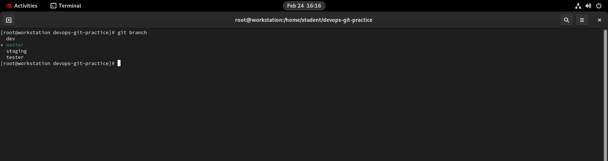
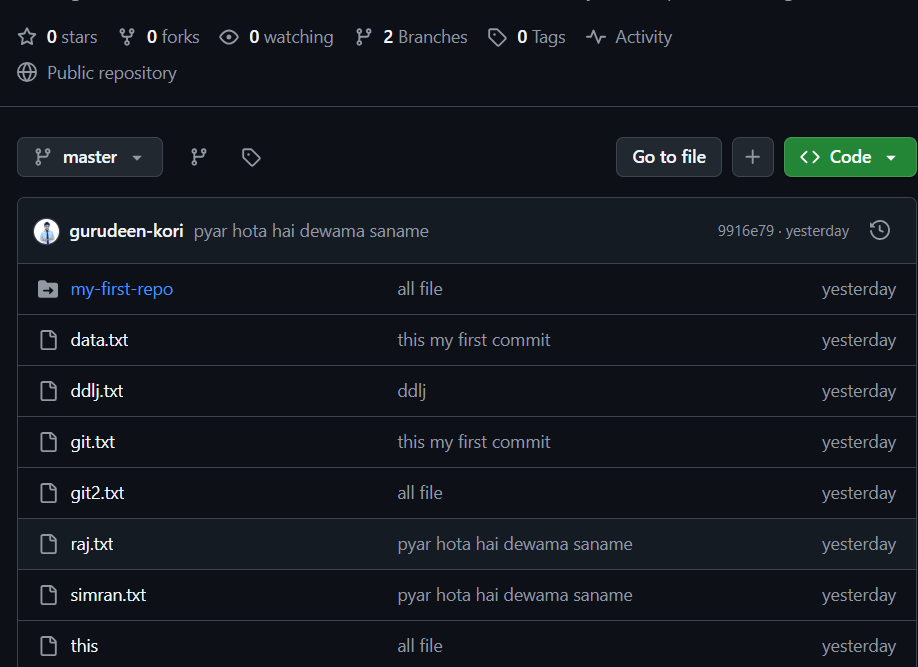
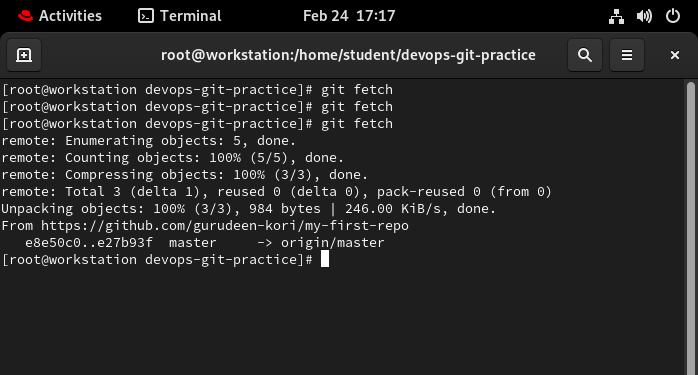

# Task 1: Understanding Branches
# What is a Branch in Git?

A branch in Git is an independent line of development. It allows developers to work on features, bug fixes, or experiments without affecting the main codebase.

## Key Points

- A branch is a pointer to a commit.
- The default branch is usually called `main`.
- Branches allow parallel development.
- Changes in one branch do not affect others until merged.

## Why Use Branches?

- Feature development
- Bug fixes
- Safe experimentation
- Team collaboration

## Common Commands

Create a branch:
```bash 
git branch feature-name
```
Switch to a branch:
```bash 
git checkout feature-name
```
Create and switch:
```bash 
git checkout -b feature-name
```
Merge into main:
```bash 
git checkout main
git merge feature-name
```

# 2. Why Do We Use Branches Instead of Committing Everything to Main?

In Git, branches are used to keep the main branch stable and production-ready while allowing developers to work on new features, bug fixes, or experiments safely.

## Why Not Commit Everything to Main?

If all changes are committed directly to the `main` branch:

- The main codebase may become unstable.
- Bugs can immediately affect production.
- Incomplete features may be exposed.
- It becomes difficult to review changes.
- Team collaboration becomes risky and disorganized.

## Benefits of Using Branches

### 1. Keeps Main Stable
The `main` branch should always:
- Build successfully
- Pass tests
- Be ready for deployment

Branches ensure unfinished work does not affect it.

### 2. Enables Parallel Development
Multiple developers can work simultaneously on different features or fixes without interfering with each other.

Example:
- `feature-login`
- `bugfix-payment`
- `feature-dashboard`

### 3. Supports Code Review
Branches allow pull requests or merge requests where code can be reviewed and tested before merging into `main`.

### 4. Reduces Risk
If something breaks in a branch:
- Only that branch is affected.
- The `main` branch remains safe.
- The branch can be fixed or deleted.

## Conclusion

Branches help maintain stability, improve collaboration, reduce risk, and ensure that the main branch remains clean and production-ready.

# 3. What is HEAD in Git?

In Git, **HEAD** is a special pointer that refers to the currently checked-out commit. It represents your current working position in the repository.

## Simple Definition

HEAD tells Git "where you are" in the project history.

## How HEAD Works

Normally, HEAD points to a branch name, and the branch points to the latest commit.

Example:

HEAD → main → A → B → C

- `main` points to commit C.
- HEAD points to `main`.
- Your working directory matches commit C.

When you create a new commit:
- The branch moves forward.
- HEAD automatically follows the branch.

## Detached HEAD State

If you checkout a specific commit instead of a branch:

git checkout <commit-hash>

HEAD now points directly to a commit instead of a branch. This is called a **Detached HEAD** state.

In this state:
- You can view past commits.
- You can make changes.
- New commits are not attached to any branch unless you create one.

## Useful Commands

See current branch:
git branch

See commit history:
git log --oneline

See where HEAD points internally:
cat .git/HEAD

## Conclusion

HEAD is a pointer that tracks your current position in the Git repository. It usually points to a branch, which then points to the latest commit.

# 4,  What Happens to Your Files When You Switch Branches in Git?

When you switch branches in Git, your working directory is updated to match the snapshot of the branch you switch to.

## How It Works

Each branch in Git points to a specific commit.  
Each commit stores a snapshot of the project at that point in time.

When you run:

git checkout branch-name

Git:

1. Moves HEAD to the selected branch.
2. Updates the working directory to match that branch’s latest commit.
3. Changes, adds, or removes files as needed.

---

## What Happens to Different Types of Changes?

### 1. Committed Changes
- Safely stored in the branch.
- Switching branches restores files to that branch's committed state.

### 2. Uncommitted Changes
- If changes do NOT conflict, Git keeps them.
- If changes conflict with the target branch, Git prevents switching and shows an error.

Example error:
"Please commit your changes or stash them before switching branches."

### 3. Untracked Files
- Usually remain in your working directory.
- Unless they conflict with files in the branch you switch to.

---

## Example Scenario

Branch `main`:
file.txt → "Version 1"

Branch `feature`:
file.txt → "Version 2"

If you're on `main` and switch to `feature`,  
Git updates `file.txt` to show "Version 2".

---

## Important Notes

- Switching branches changes your working directory files.
- Git does not merge changes automatically when switching.
- Always commit or stash your work before switching branches.

---

## Summary

When you switch branches, Git updates your files to match the selected branch’s latest commit. Committed changes are preserved in their branches, while uncommitted changes may block the switch if conflicts exist.
---
---
Task 2: Branching Commands — Hands-On

 ***1. List all branches in your repo***
```bash 
git branch 
```

***2. Create a new branch called feature-1***
```bash 
git checkout -b feature-1
```

***3. Switch to feature-1***
```bash
git switch  feature-1
```
***4. Create a new branch and switch to it in a single command — call it feature-2***
```bash
git checkout -b feature-1
```
****5. Try using git switch to move between branches — how is it different from git checkout?****
- git checkout -b feature-1
# or using the newer command:
- git switch -c feature-1
- Switching Between Branches

git checkout <branch>
Old command for switching branches; can also checkout commits or files.

git switch <branch>
Newer, simpler command to switch branches only. Recommended for clarity.

***6. Make a commit on feature-1 that does not exist on main***
```bash
# Make changes to a file
git add .
git commit -m "Add feature-1 changes"
```
***7.Switch back to main — verify that the commit from feature-1 is not there***
```bash
git switch main
git switch main #history 

```
***8. Delete a branch you no longer need***
```
git branch -d feature-1   # Deletes if merged
git branch -D feature-1   # Force delete even if not merged
```
***Add all branching commands to your git-commands.md***
# Task 3: Push to GitHub
***Connect your local devops-git-practice repo to the GitHub remote***

***Verify both branches are visible on GitHub***


# Difference Between `origin` and `upstream` in Git

In Git, **remote repositories** are referenced by names. The two most common remote names are `origin` and `upstream`.

---

## Key Differences

| Feature        | `origin`               | `upstream`                                       |
| -------------- | --------------------- | ------------------------------------------------ |
| Default name   | Yes, after clone      | No, you must add manually                        |
| Points to      | Your fork / copy      | Original repository                              |
| Used for       | Pushing your changes  | Fetching updates from original                   |
| Typical commands | `git push origin main` | `git fetch upstream` / `git merge upstream/main` |

---

## Summary

- **`origin`** → Your repository (where you push changes).  
- **`upstream`** → Original repository (where you pull updates).  
- Both are remote references that help manage forks and collaboration workflows.
- 
# Task 4: Pull from GitHub
# Pulling Changes from GitHub and Understanding `git fetch` vs `git pull`

## 1. Make a Change Directly on GitHub

1. Go to the repository on GitHub.
2. Open the file you want to edit.
3. Click the **pencil icon** to edit the file using the GitHub editor.
4. Make your change.
5. Commit directly to the `main` branch (or your working branch) with a commit message.

---

## 2. Pull the Change to Your Local Repository

From your local repository:

```bash
# Switch to the branch you edited on GitHub
git switch main

# Pull changes from GitHub
git pull origin main
```

# 3.  Difference Between `git fetch` and `git pull`

| Command      | Description                                                                                         |
| ------------ | --------------------------------------------------------------------------------------------------- |
| `git fetch`  | Downloads changes from the remote repository but **does not merge** them into your local branch. You can inspect changes before merging. |
| `git pull`   | Downloads changes from the remote repository **and automatically merges** them into your current branch. It is essentially `git fetch` + `git merge`. |

---

## Example Use Case

- **Use `git fetch`** when you want to review incoming changes before applying them.
- **Use `git pull`** when you are ready to integrate remote changes immediately.
- 


