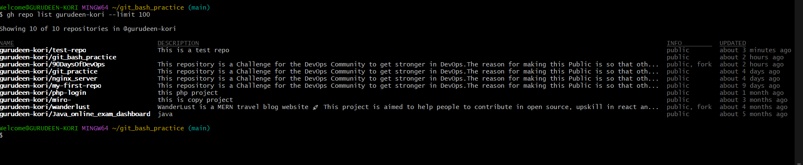
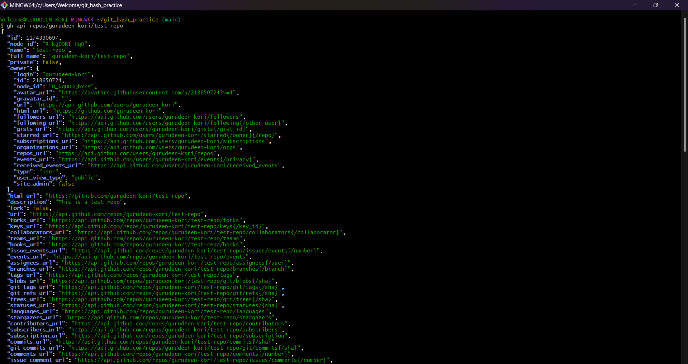

## Task 1: Install and Authenticate
**1. Install the GitHub CLI on your machine**
```bash
 winget install GitHub.cli
```
**2. Authenticate with your GitHub account**
```bash
gh auth login
```

**3. Verify you're logged in and check which account is active**
```
gh auth status
```


** 4. What authentication methods does gh support?**
# GitHub CLI Authentication Methods

The GitHub CLI (`gh`) supports several authentication methods for accessing GitHub.

## 1. Web Browser OAuth
- This is the default authentication method.
- The CLI opens a web browser where the user logs in and authorizes GitHub CLI.

## 2. Device Code Flow
- Used when a browser cannot be opened automatically.
- A one-time code is generated in the terminal.
- The user enters the code at https://github.com/login/device to authenticate.

## 3. Personal Access Token (PAT)
- Users can authenticate using a GitHub personal access token instead of browser login.
- Useful for automation and scripts.

Summary

GitHub CLI supports the following authentication methods:

- Web browser OAuth login
- Device code login
- Personal Access Token (PAT)
- Environment variable tokens

SSH key authentication for Git operations
Example command:
```bash
gh auth login
gh repo clone <owner>/<repo>
gh repo create <repo-name> --public
```
# Task 2: Working with Repositories using GitHub CLI

This document contains all commands to complete Task 2 using the GitHub CLI (`gh`).

---

## 1️⃣ Create a new GitHub repository (public with README)
```bash
gh repo create test-repo --public --description "This is a test repo" --readme
```
## 2️⃣ Clone the repository using gh
```
gh repo clone gurudeen-kori/test-repo
```
## 3️⃣ View details of the repository
```
gh repo view gurudeen-kori/test-repo
```
Shows description, visibility, default branch, URL, etc.

Optional: Open repo details in browser
```
gh repo view gurudeen-kori/test-repo --web
```
## 4️⃣ List all your repositories
```
gh repo list gurudeen-kori --limit 100
```
Lists up to 100 repositories owned by gurudeen-kori

## 5️⃣ Open a repository in your browser
```
gh repo view gurudeen-kori/test-repo --web
```
## 6️⃣ Delete the test repository (Be careful!)
```
gh repo delete gurudeen-kori/test-repo --confirm
```

# Task 3: Working with Issues using GitHub CLI

This document contains all commands to complete Task 3 using the GitHub CLI (`gh`) for your repository.

---

## 1️⃣ Create an issue with a title, body, and label
```bash
gh issue create --repo gurudeen-kori/test-repo \
```
  --title "Sample Issue" \
  --body "This is a test issue created from the terminal using GitHub CLI." \
  --label "bug"

- --repo → specify the repository (username/repo)
- --title → title of the issue
- --body → description or details of the issue
- --label → assign a label to the issue (must exist in the repo; default labels include bug, enhancement, etc.)

# 2️⃣ List all open issues on the repository
gh issue list --repo gurudeen-kori/test-repo --state open

--state open → lists only open issues

You can also filter by label, assignee, or author if needed

# 3️⃣ View a specific issue by its number
```
gh issue view 1 --repo gurudeen-kori/test-repo
```

# 4️⃣ Close an issue from the terminal
```
gh issue close 1 --repo gurudeen-kori/test-repo
```


# Task 4: Pull Requests using GitHub CLI

This document contains commands to work with Pull Requests using the GitHub CLI (`gh`).

Repository used: **gurudeen-kori/test-repo**

---

# 1️⃣ Create a branch, make a change, push it, and create a Pull Request

### Create and switch to a new branch

```bash
git checkout -b feature-update
```

### Make a change (example: edit README)

```bash
echo "This change was made from a new branch." >> README.md
```

### Stage and commit the change

```bash
git add README.md
git commit -m "Update README from feature branch"
```

### Push the branch to GitHub

```bash
git push origin feature-update
```

### Create a Pull Request from the terminal

```bash
gh pr create \
  --repo gurudeen-kori/test-repo \
  --title "Update README via feature branch" \
  --body "This PR updates the README file from the feature branch." \
  --base main \
  --head feature-update
```

---

# 2️⃣ List all open Pull Requests

```bash
gh pr list --repo gurudeen-kori/test-repo --state open
```

This shows:

* PR number
* title
* branch
* status

---

# 3️⃣ View details of your Pull Request

Example for PR number **1**:

```bash
gh pr view 1 --repo gurudeen-kori/test-repo
```

This command displays:

* PR title
* description
* status
* reviewers
* CI checks
* commits included in the PR

### Optional: Open PR in browser

```bash
gh pr view 1 --repo gurudeen-kori/test-repo --web
```

---

# 4️⃣ Merge the Pull Request from the terminal

```bash
gh pr merge 1 --repo gurudeen-kori/test-repo --merge
```

This merges the PR into the `main` branch.

---

# Notes

## What merge methods does `gh pr merge` support?

`gh pr merge` supports three merge methods:

1. **Merge commit**

```
gh pr merge <number> --merge
```

2. **Squash merge**

```
gh pr merge <number> --squash
```

3. **Rebase merge**

```
gh pr merge <number> --rebase
```

---

## How would you review someone else's PR using `gh`?

You can review a pull request using the following commands:

### View the PR

```bash
gh pr view <number>
```

### Checkout the PR locally

```bash
gh pr checkout <number>
```

This lets you test the changes on your machine.

### Add a review comment

```bash
gh pr review <number> --comment -b "Looks good, but consider improving the documentation."
```

### Approve the PR

```bash
gh pr review <number> --approve
```

### Request changes

```bash
gh pr review <number> --request-changes -b "Please fix the bug in line 25."
```

These commands allow you to review, approve, or request modifications directly from the terminal.

# Task 5: GitHub Actions & Workflows (Preview)

This document contains commands for working with GitHub Actions using the GitHub CLI (`gh`).

---

# 1️⃣ List workflow runs on a public repository

Example using a public repository:

```bash
gh run list --repo cli/cli
```

This command shows:

* Workflow run ID
* Workflow name
* Branch
* Status (success, failure, running)
* Event that triggered the workflow

You can also limit results:

```bash
gh run list --repo cli/cli --limit 10
```

---

# 2️⃣ View the status of a specific workflow run

First get the **run ID** from the previous command.

Example:

```bash
gh run view <run-id> --repo cli/cli
```

Example with an actual command format:

```bash
gh run view 123456789 --repo cli/cli
```

This command displays:

* Workflow status
* Jobs executed
* Logs
* Commit associated with the run

You can also open it in the browser:

```bash
gh run view <run-id> --repo cli/cli --web
```

---

# Notes

## How could `gh run` and `gh workflow` be useful in a CI/CD pipeline?

`gh run` and `gh workflow` help developers manage CI/CD pipelines directly from the terminal without opening the GitHub website.

### Benefits in CI/CD pipelines

**1. Monitor pipeline status**

* Developers can quickly check if builds or tests passed.
* Example:

```bash
gh run list
```

**2. View logs for debugging**

* If a pipeline fails, logs can be viewed immediately.
* Example:

```bash
gh run view <run-id> --log
```

**3. Trigger workflows manually**

* Useful for redeployments or manual builds.
* Example:

```bash
gh workflow run <workflow-name>
```

**4. Automate deployment scripts**

* DevOps scripts can check workflow results before continuing deployment.

**5. Faster troubleshooting**

* Developers can identify failed jobs and inspect logs without leaving the terminal.

Overall, `gh run` and `gh workflow` allow teams to **monitor, control, and automate CI/CD pipelines efficiently from the command line**.

# Task 6: Useful GitHub CLI (`gh`) Tricks

This section lists useful GitHub CLI commands that can help improve productivity when working with GitHub from the terminal.

---

# 1️⃣ `gh api` — Make raw GitHub API calls

The `gh api` command allows you to interact directly with the GitHub REST API from the terminal.

Example: Get information about a repository.

```bash
gh api repos/gurudeen-kori/test-repo
```

Example: Get your authenticated user information.

```bash
gh api user
```

This is useful when:

* accessing advanced GitHub API features
* building automation scripts
* retrieving repository data programmatically

---

# 2️⃣ `gh gist` — Create and manage GitHub Gists

GitHub Gists are useful for sharing small code snippets or notes.

Create a new gist:

```bash
gh gist create notes.txt
```

Create a **public gist with description**:

```bash
gh gist create script.sh --desc "Example shell script" --public
```

List your gists:

```bash
gh gist list
```

View a gist:

```bash
gh gist view <gist-id>
```

---

# 3️⃣ `gh release` — Create and manage releases

Releases are used to publish versions of your project.

Create a new release:

```bash
gh release create v1.0.0 --title "First Release" --notes "Initial project release"
```

List releases:

```bash
gh release list
```

View release details:

```bash
gh release view v1.0.0
```

Delete a release:

```bash
gh release delete v1.0.0
```

---

# 4️⃣ `gh alias` — Create shortcuts for frequent commands

`gh alias` allows you to create custom shortcuts for commands you use often.

Example: Create a shortcut to list your repositories.

```bash
gh alias set myrepos "repo list gurudeen-kori"
```

Use the alias:

```bash
gh myrepos
```

List all aliases:

```bash
gh alias list
```

Delete an alias:

```bash
gh alias delete myrepos
```

---

# 5️⃣ `gh search repos` — Search GitHub repositories

Search for repositories directly from the terminal.

Example: Search for repositories related to Docker.

```bash
gh search repos docker
```

Search repositories written in Python:

```bash
gh search repos "machine learning" --language python
```

Limit results:

```bash
gh search repos devops --limit 10
```

This is useful for:

* discovering open-source projects
* finding code examples
* exploring popular repositories

---

# Summary

These GitHub CLI features help developers:

* automate GitHub operations
* manage code releases
* share snippets quickly
* create custom command shortcuts
* search GitHub repositories without leaving the terminal


