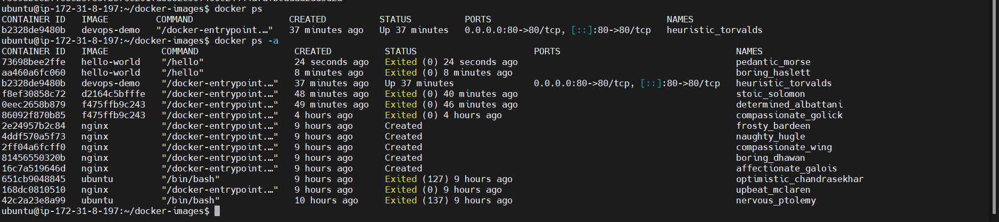
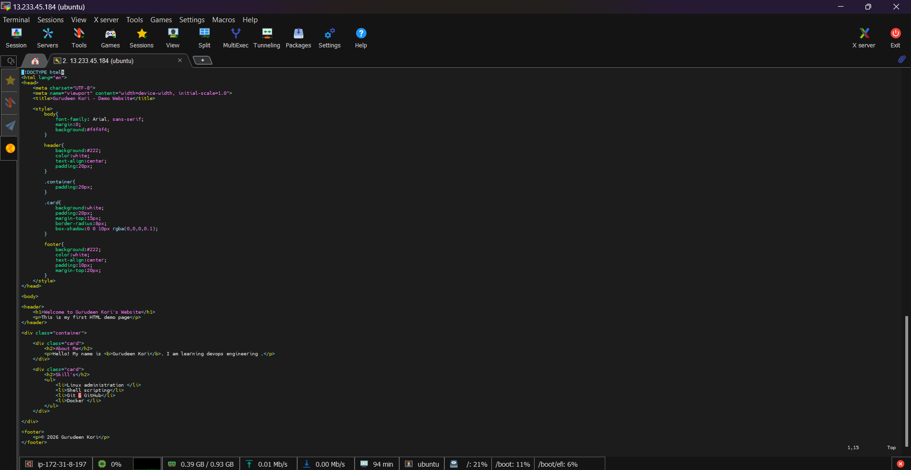
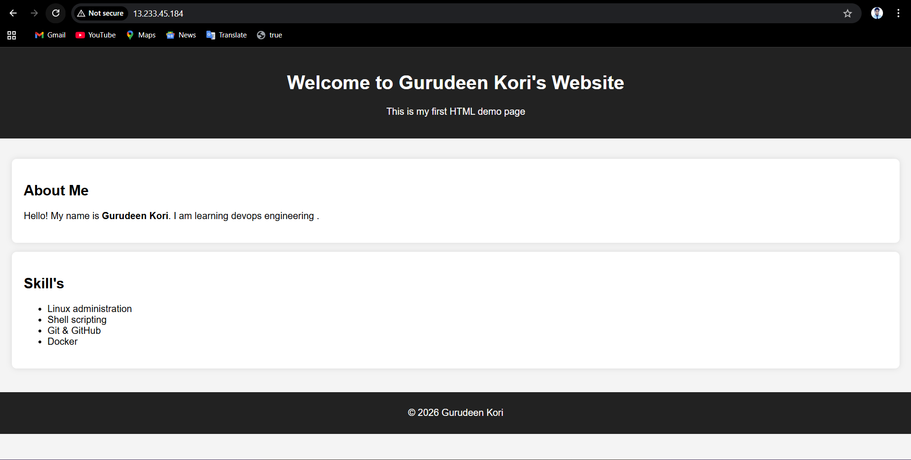

Task 1: What is Docker?
# 1. What is Docker?

**Docker** is an open-source platform used to **develop, package, and run applications inside containers**.  
Containers are lightweight, portable environments that include everything needed to run an application such as code, libraries, dependencies, and system tools.

## Key Idea

Docker allows developers to **build an application once and run it anywhere** without worrying about differences between environments (development, testing, or production).

## How Docker Works

### 1. Docker Image
A **Docker Image** is a blueprint or template that contains the application and all its dependencies required to run it.

### 2. Docker Container
A **Docker Container** is a running instance of a Docker image. Containers are isolated from each other and from the host system.

### 3. Docker Engine
**Docker Engine** is the core software that builds, runs, and manages Docker containers.

## Why Docker is Used

- **Consistency** – Same environment for development, testing, and production.
- **Portability** – Containers can run on any system that has Docker installed.
- **Isolation** – Applications run independently without conflicts.
- **Efficiency** – Containers are lightweight compared to virtual machines.

## Simple Example

A developer can package a Python web application along with all required libraries into a Docker image.  
Anyone can run that image and get the exact same working application without installing Python or its dependencies manually.

## Docker vs Virtual Machines

| Feature | Docker Containers | Virtual Machines |
|--------|------------------|------------------|
| Size | Lightweight | Heavy |
| Boot Time | Seconds | Minutes |
| OS | Share host OS kernel | Full OS per VM |

## Conclusion

Docker simplifies application deployment by packaging software and its dependencies into containers, making it easier to build, ship, and run applications consistently across different environments.

# 2. Containers vs Virtual Machines — What's the Real Difference?

Both **containers** and **virtual machines (VMs)** are technologies used to run applications in isolated environments. However, they work in different ways and have different performance characteristics.

---

## 1. Basic Concept

### Containers
Containers package an application along with its dependencies and run on the **same operating system kernel as the host**.

Example: Platforms like **Docker** allow applications to run in containers.

### Virtual Machines
Virtual Machines emulate **entire computers**, including their own operating systems, using a hypervisor.

Example: Tools like **VMware** or **VirtualBox** create virtual machines.

---


## 2. Key Differences

| Feature | Containers | Virtual Machines |
|-------|-------------|------------------|
| Virtualization Type | OS-level | Hardware-level |
| Operating System | Share host OS kernel | Each VM has its own OS |
| Size | Lightweight (MBs) | Heavy (GBs) |
| Startup Time | Seconds | Minutes |
| Performance | Near-native | Slightly slower |
| Isolation | Process-level | Stronger full isolation |

---

## 3. Resource Usage

- **Containers**
  - Use fewer resources
  - Run many containers on one host
  - Ideal for microservices and cloud apps

- **Virtual Machines**
  - Consume more CPU, RAM, and storage
  - Suitable when full OS isolation is required

---

## 4. Real-World Use Cases

### Containers
- Microservices architecture
- Continuous Integration / Continuous Deployment (CI/CD)
- Cloud-native applications
- Dev/Test environments

### Virtual Machines
- Running different operating systems on the same machine
- Legacy applications
- Strong security isolation
- Enterprise workloads

---

## 5. Example

If you deploy a **Node.js web application**:

- With **Containers** → Only Node.js and the app are packaged.
- With **Virtual Machines** → A full OS (Linux/Windows) + Node.js + the app are included.

---

## Conclusion

- **Containers** are lightweight, fast, and ideal for modern cloud applications.
- **Virtual Machines** provide stronger isolation and full OS environments.

In modern cloud platforms, containers are widely used because they are **faster, more portable, and more efficient**.
Get smart
# 3. What is the Docker architecture? (daemon, client, images, containers, registry

# Docker Architecture

Docker architecture describes how different components of Docker work together to create, manage, and run containers. The main components are:

- Docker Client  
- Docker Daemon  
- Docker Images  
- Docker Containers  
- Docker Registry  

---

## 1. Docker Client

The **Docker Client** is the interface through which users interact with Docker.

When you run commands such as:

```bash
docker build
docker pull
docker run
```
the Docker client sends these commands to the Docker daemon.

Example flow

User → Docker Client → Docker Daemon
# 2. Docker Daemon

The Docker Daemon (dockerd) is the main service that runs in the background on the host machine.

Its responsibilities include:

Building Docker images

Running and managing containers

Managing networks

Handling storage volumes

The daemon listens for requests from the Docker client and processes them.

# 3. Docker Images

A Docker Image is a read-only template used to create containers.

It contains everything needed to run an application:

- Application code
- System libraries
- Dependencies
- Runtime environment
- Images are usually created using a Dockerfile.

Example:

Ubuntu + Python + App Code = Docker Image
# 4. Docker Containers

A Docker Container is a running instance of a Docker image.

It is a lightweight and isolated environment where the application runs.

- Key features:
- Fast startup
- Lightweight
- Isolated from other containers
- Easy to start, stop, and remove

Example:
Docker Image → Run → Docker Container
# 5. Docker Registry

A Docker Registry is a storage location where Docker images are stored and shared.

- Developers can:
- Push images to a registry
- Pull images from a registry
- Common registries include public and private repositories.

Task 2: Install Docker

# 1.Install Docker on your machine (or use a cloud instance)
```
apt-get update -y && apt-get install -y docker.io 

```
Verify the installation
```
docker -v 

```



# Task 3: Run Real Containers
**1. Run an Nginx container and access it in your browser**
```bash 
docker run -d -p 80:80 nginx
```



# 2. Run an Ubuntu container in interactive mode — explore it like a mini Linux machine

## 1. Run an Nginx Container and Access It in Your Browser

Run the Nginx container:

```bash
docker run -d -p 8080:80 --name my-nginx nginx
```
Explanation:

- -d → Run container in background (detached mode)
- -p 8080:80 → Map port 8080 on host to 80 in container
- --name my-nginx → Give the container a name
- nginx → Docker image name

**Now open your browser and visit:**

http://13.233.45.184:80

You should see the Nginx welcome page.

# 2. Run an Ubuntu Container in Interactive Mode

Start an Ubuntu container with an interactive terminal:
```
docker run -it ubuntu
```
Explanation:

- -i → Interactive mode
- -t → Allocate terminal

Example commands inside the container:

- ls
- pwd
- apt update
- whoami

Exit the container:

exit
# 3. List All Running Containers
docker ps

This shows:

| Container ID  |    Image   |   Status  | Ports  | Names |


# 4. List All Containers (Including Stopped Ones)
docker ps -a


docker stop <container_id>
# 6. Remove a Container

Remove a stopped container:
```
docker rm my-nginx 
```
# Docker Task 4: Explore Container Features

## 1. Run a Container in Detached Mode — What's Different?

Detached mode runs a container **in the background**, allowing your terminal to remain free for other commands.

Command:

```bash
docker run -d nginx
```
## 2. Give a Container a Custom Name

You can assign a custom name using the --name option.
```
docker run -d --name my-web-server nginx
```
**Benefits:**

- Easier to manage containers
- No need to remember container IDs
- 
## 3. Map a Port from the Container to Your Host

Port mapping allows your host machine to access services inside a container.

Command:
```
docker run -d -p 8080:80 nginx
```
## 4. Check Logs of a Running Container

To view logs from a running container:
```
docker logs <container_name>
```
## 5. Run a Command Inside a Running Container

Use docker exec to run commands inside an active container.

Example:
```
docker exec -it my-web-server bash
```
