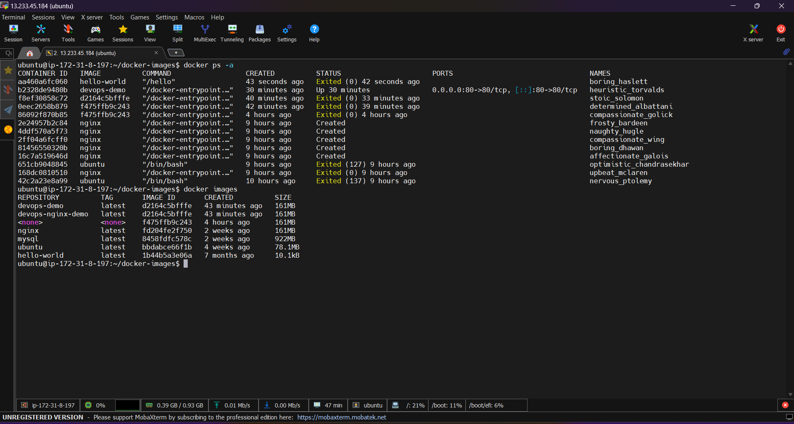
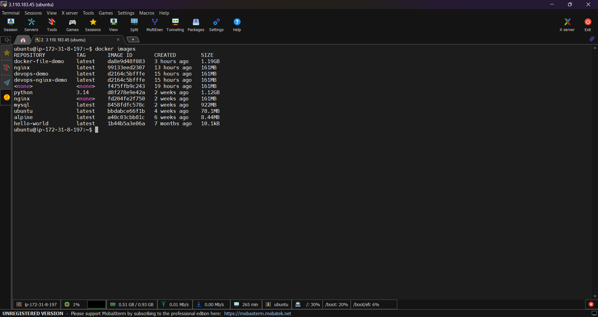
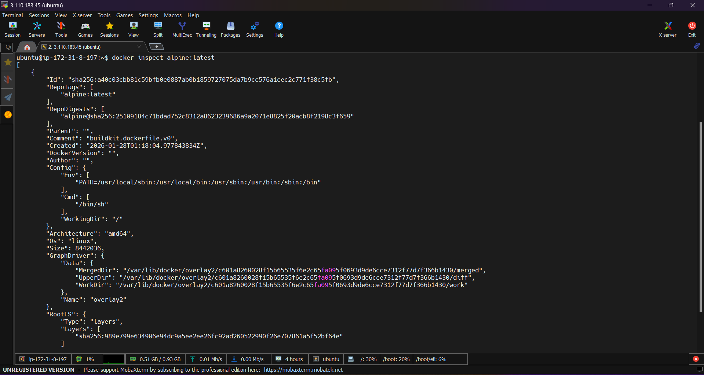
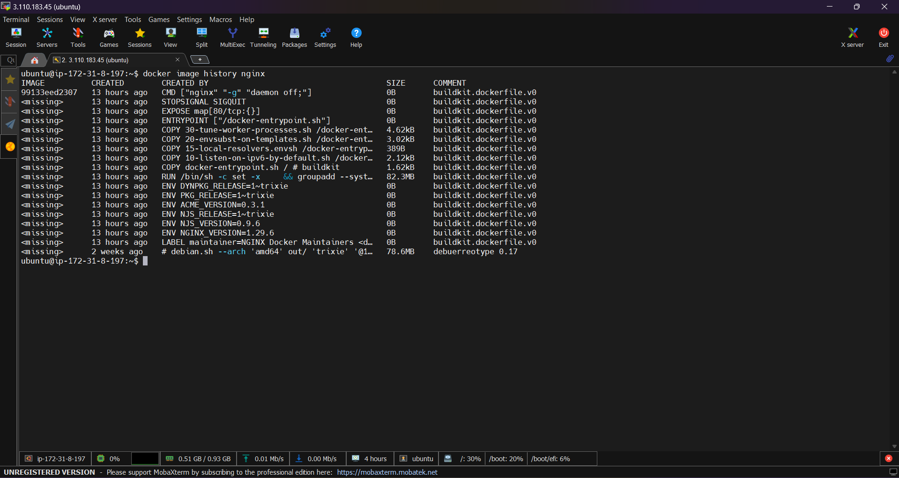
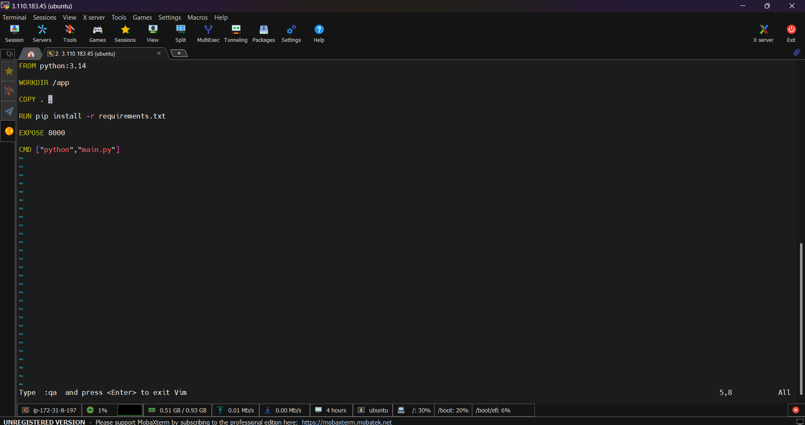
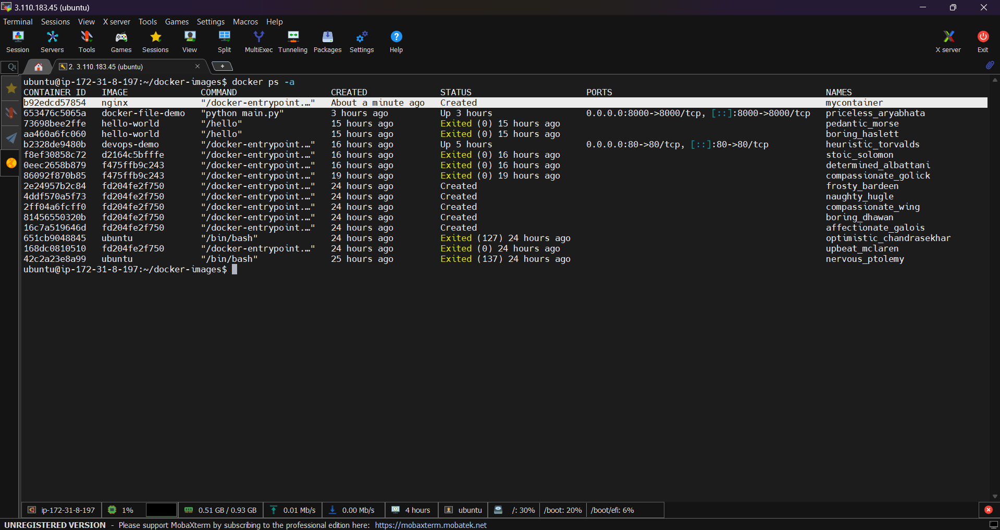
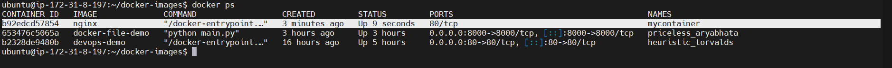
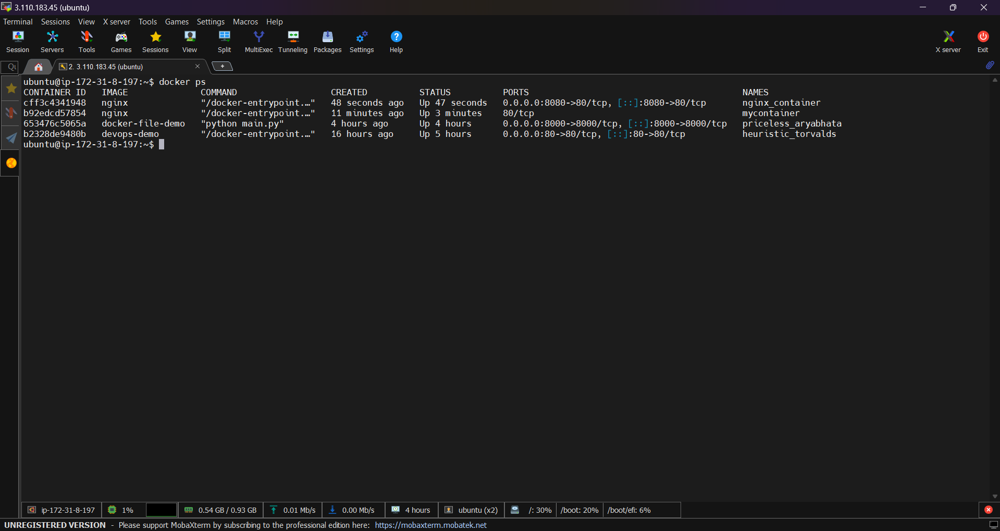
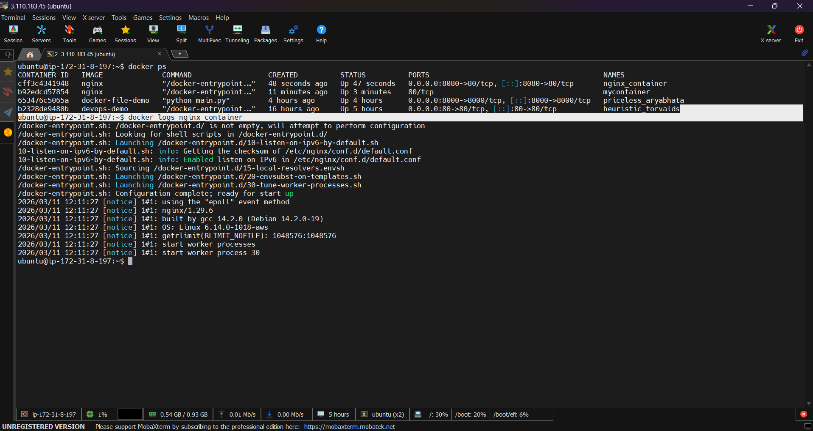
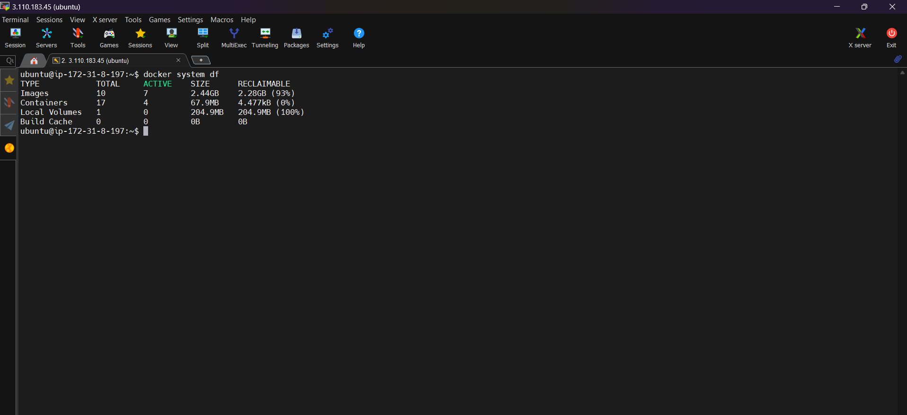

# Task 1: Docker Images
# Docker Images Task

## Objective
Learn how to work with Docker images by pulling images, inspecting them, comparing sizes, and removing unused images.

---

# 1. Pull Required Images from Docker Hub

Pull the **nginx**, **ubuntu**, and **alpine** images using the following commands:

```bash
docker pull nginx
docker pull ubuntu
docker pull alpine
```

These commands download the images from **Docker Hub**.

---

# 2. List All Images and Check Sizes

To list all images stored on your machine:

```bash
docker images
```


---

# 3. Compare Ubuntu vs Alpine

| Feature | Ubuntu | Alpine |
|------|------|------|
| Distribution Type | Full Linux distribution | Minimal Linux distribution |
| Image Size | Larger (~70MB) | Very small (~7MB) |
| Package Manager | apt | apk |
| C Library | GNU libc | musl libc |
| Use Case | General-purpose containers | Lightweight containers |

### Why Alpine is Smaller

Alpine Linux is much smaller because:

- It includes only minimal required packages
- Uses **musl libc** instead of **GNU libc**
- Removes unnecessary utilities
- Designed specifically for container environments

---

# 4. Inspect a Docker Image

To inspect detailed information about an image:

```bash
docker inspect ubuntu
```

or

```bash
docker inspect alpine
```

### Information 

The `docker inspect` command provides metadata in JSON format including:

- Image ID
- Creation date
- Architecture
- Operating System
- Image layers
- Environment variables
- Default command
- Labels
- Container configuration

Example snippet:



---

# 5. Remove an Unused Image

To remove an image:

```bash
docker rmi ubuntu
```

or

```bash
docker rmi alpine
```

### Note
If the image is used by a container, you must remove the container first.

Check existing containers:

```bash
docker ps -a
```

---

# Conclusion

In this task, we:
- Pulled Docker images from Docker Hub
- Listed available images and observed their sizes
- Compared Ubuntu and Alpine images
- Inspected image metadata
- Removed unused images

This helps understand how Docker images work and how to manage them efficiently.


# Task 2: Docker Image Layers

## Objective
Understand Docker image layers and how Docker builds images using layered architecture.

---

# 1. View Image Layer History

To see the layers of the **nginx** image, run:

```bash
docker image history nginx
```

### Example Output


---

# 2. Observations

- Each row in the output represents an **image layer**.
- Some layers show a **size (MB)** because they add files or install packages.
- Some layers show **0B** because they only add metadata or configuration changes (such as `CMD`, `ENV`, or `EXPOSE`).

---

# 3. What Are Docker Layers?

Docker images are built using a **layered filesystem**.

A **layer** is a read-only change made to the image.  
Each command in a Dockerfile (such as `RUN`, `COPY`, `ADD`) creates a new layer.

Example Dockerfile:
```Dockerfile
FROM python:3.14
WORKDIR /app
COPY . .
RUN pip install -r requirements.txt
EXPOSE 8000
CMD ["python","main.py"]

```

Each instruction creates a separate layer.

---

# 4. Why Docker Uses Layers

Docker uses layers for several important reasons:

### 1. Efficiency
Layers are cached. If a layer already exists, Docker reuses it instead of rebuilding it.

### 2. Faster Builds
When rebuilding an image, Docker only rebuilds the layers that changed.

### 3. Reduced Storage
Multiple images can **share the same layers**, saving disk space.

Example:
- `nginx` image
- `ubuntu` image

Both may share the same base OS layer.

### 4. Faster Image Distribution
When pushing or pulling images, Docker only transfers **layers that are missing**.

---

# 5. key points

- Docker images are made up of multiple **layers**.
- Each Dockerfile instruction creates a new layer.
- Layers can contain file changes, installed packages, or configuration metadata.
- Docker uses layers to improve **speed, storage efficiency, and reuse**.

---

# Task 3: Docker Container Lifecycle

## Objective
Practice the full lifecycle of a Docker container and observe how its state changes using `docker ps -a`.

---

# 1. Create a Container (Without Starting)

Create a container from the **nginx** image without starting it.

```bash
docker create --name mycontainer nginx
```

Check container status:

```bash
docker ps -a
```



---

# 2. Start the Container

Start the container:

```bash
docker start mycontainer
```

Check status:

```bash
docker ps -a
```

### Expected State
```
Up (Running)
```

---

# 3. Pause the Container

Pause the running container:

```bash
docker pause mycontainer
```

Check status:

```bash
docker ps -a
```

### Expected State
```
Paused
```

---

# 4. Unpause the Container

Resume the paused container:

```bash
docker unpause mycontainer
```

Check status again:

```bash
docker ps -a
```

### Expected State
```
Up (Running)
```

---

# 5. Stop the Container

Stop the running container:

```bash
docker stop mycontainer
```

Check status:

```bash
docker ps -a
```

### Expected State
```
Exited
```

---

# 6. Restart the Container

Restart the stopped container:

```bash
docker restart mycontainer
```

Check status:

```bash
docker ps -a
```

### Expected State
```
Up (Running)
```

---

# 7. Kill the Container

Forcefully stop the container:

```bash
docker kill mycontainer
```

Check status:

```bash
docker ps -a
```

### Expected State
```
Exited
```

---

# 8. Remove the Container

Remove the container:

```bash
docker rm mycontainer
```

Check containers again:

```bash
docker ps -a
```

### Expected Result
The container will no longer appear in the list.

---

# Summary of Container States

| Command | Container State |
|------|------|
| `docker create` | Created |
| `docker start` | Running |
| `docker pause` | Paused |
| `docker unpause` | Running |
| `docker stop` | Exited |
| `docker restart` | Running |
| `docker kill` | Exited |
| `docker rm` | Removed |

---

# Conclusion

In this task, we practiced the complete lifecycle of a Docker container.  
By checking `docker ps -a` after each step, we observed how the container state changes from **Created → Running → Paused → Exited → Removed**.

# Task 4: Working with Running Containers

## Objective
Learn how to manage and interact with running Docker containers by viewing logs, executing commands, and inspecting container details.

---

# 1. Run an Nginx Container in Detached Mode

Run the container in detached mode so it runs in the background.

```bash
docker run -d --name nginx_container -p 8080:80 nginx
```

### Explanation
- `-d` → Run container in background (detached mode)
- `--name` → Assign a custom name to the container
- `-p 8080:80` → Map port **8080 (host)** to **80 (container)**

Check running containers:

```bash
docker ps
```

---

# 2. View Container Logs

To see logs generated by the container:

```bash
docker logs nginx_container
```

This shows all log output from the container.

---

# 3. View Real-Time Logs (Follow Mode)

To continuously monitor logs:

```bash
docker logs -f nginx_container
```

Press **CTRL + C** to exit the log stream.

---

# 4. Exec Into the Container

Open a shell inside the running container:

```bash
docker exec -it nginx_container /bin/bash
```

If bash is unavailable:

```bash
docker exec -it nginx_container /bin/sh
```

### Explore the Filesystem

Example commands inside the container:

```bash
ls /
ls /usr
ls /etc
ls /var
```

Exit the container shell:

```bash
exit
```

---

# 5. Run a Single Command Inside the Container

Run a command without entering the container:

```bash
docker exec nginx_container ls /
```

Example:

```bash
docker exec nginx_container cat /etc/os-release
```

This executes the command directly inside the container.

---

# 6. Inspect the Container

To view detailed container information:

```bash
docker inspect nginx_container
```

This command returns JSON metadata about the container.

---

# 7. Find Important Details

From the `docker inspect` output you can find:

### Container IP Address

Look for:

```json
"IPAddress": "172.17.0.2"
```

---


This means:
- Container port **80**
- Mapped to host port **8080**

---

### Mounts / Volumes

Example:

```json
"Mounts": []
```

If volumes are attached, they will appear here.

---

# Summary

| Command | Purpose |
|------|------|
| `docker run -d` | Run container in background |
| `docker logs` | View container logs |
| `docker logs -f` | View live logs |
| `docker exec -it` | Enter container shell |
| `docker exec` | Run single command |
| `docker inspect` | View detailed container information |

---

# Task 5: Docker Cleanup

## Objective
Learn how to clean up Docker resources by stopping containers, removing unused containers and images, and checking Docker disk usage.

---

# 1. Stop All Running Containers

To stop all currently running containers in one command:

```bash
docker stop $(docker ps -q)
```

### Explanation
- `docker ps -q` → Lists IDs of all running containers  
- `docker stop` → Stops those containers

---

# 2. Remove All Stopped Containers

To remove every container that is in the **Exited** state:

```bash
docker rm $(docker ps -aq)
```

### Explanation
- `docker ps -aq` → Lists IDs of **all containers**
- `docker rm` → Removes them

If you only want to remove stopped containers:

```bash
docker container prune
```

Docker will ask for confirmation before deleting them.

---

# 3. Remove Unused Images

To remove images that are not used by any container:

```bash
docker image prune
```

For removing **all unused images (including dangling and unreferenced images)**:

```bash
docker image prune -a
```

---

# 4. Check Docker Disk Usage

To see how much disk space Docker is using:

```bash
docker system df
```

### Example Output



### Explanation

- **Images** → Docker images stored on the system  
- **Containers** → Space used by containers  
- **Volumes** → Persistent storage used by containers  
- **Reclaimable** → Space that can be freed by cleanup

---

# 5. Clean Everything (Optional)

To remove unused containers, images, networks, and cache:

```bash
docker system prune
```

To remove **everything including unused images and volumes**:

```bash
docker system prune -a
```

---

# Summary

| Command | Purpose |
|------|------|
| `docker stop $(docker ps -q)` | Stop all running containers |
| `docker rm $(docker ps -aq)` | Remove all containers |
| `docker container prune` | Remove stopped containers |
| `docker image prune -a` | Remove unused images |
| `docker system df` | Check Docker disk usage |
| `docker system prune` | Clean unused Docker resources |

---

# Conclusion

In this task, we performed Docker cleanup operations by stopping running containers, removing unused containers and images, and checking disk space usage. These commands help keep the Docker environment clean and prevent unnecessary storage consumption.