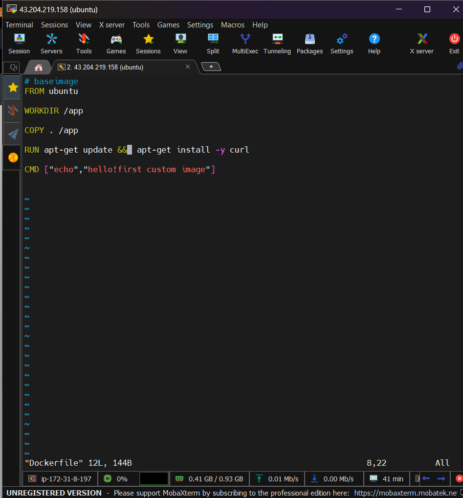
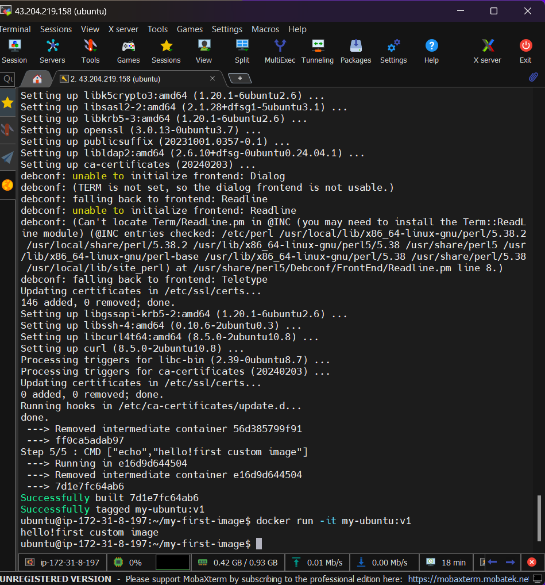
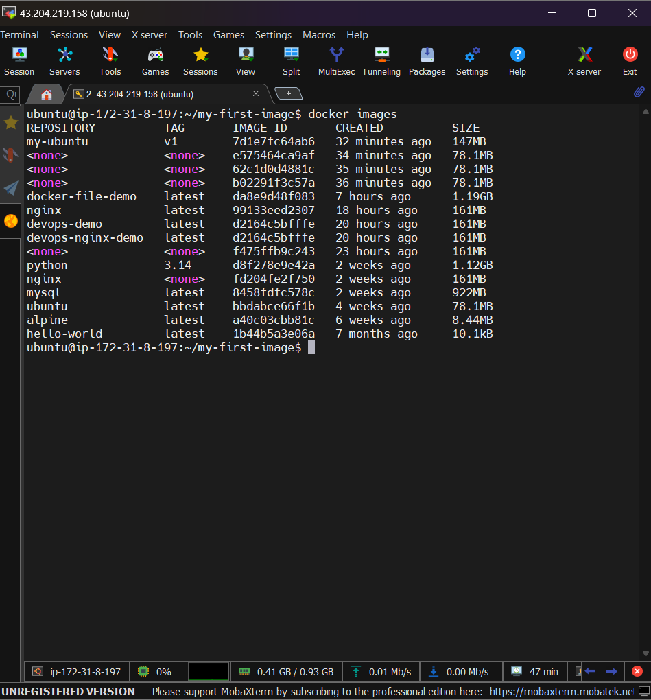
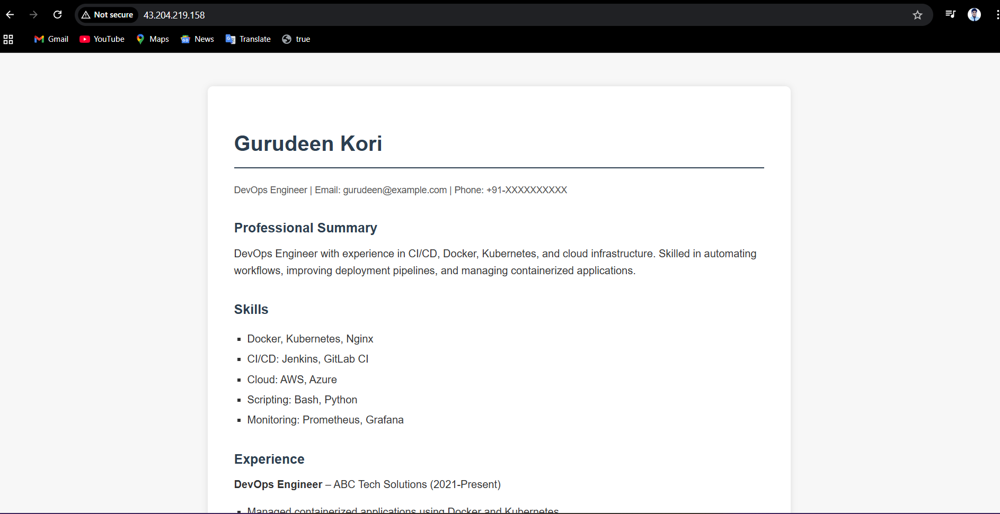
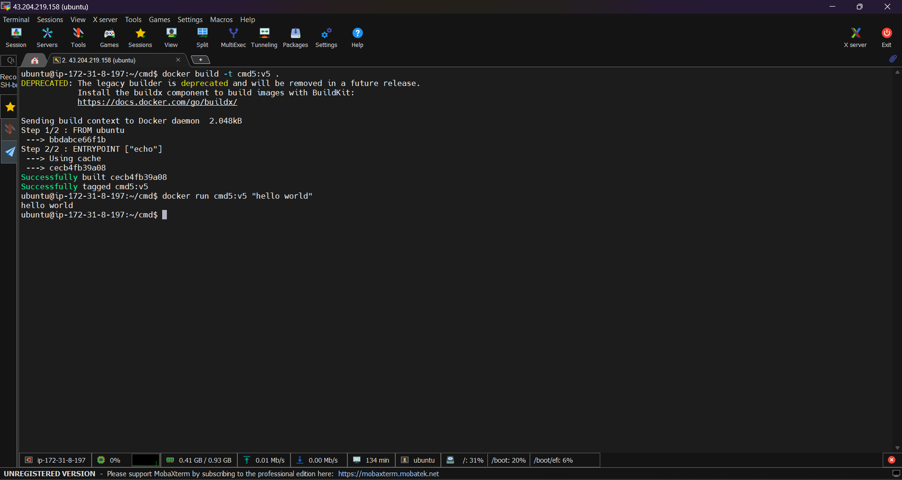

# Task 1: Your First Dockerfile

This task demonstrates how to create a basic Docker image using a Dockerfile, build it, and run a container that prints a message.

---

##  1: Create the Project Folder

Open a terminal and run:

```bash
mkdir my-first-image
cd my-first-image
```

This creates a new directory for the project and moves into it.

---

##  2: Create the Dockerfile

Inside the `my-first-image` folder, create a file named **Dockerfile** (no file extension).

Example command:

```bash
nano Dockerfile
```

Add the following content to the Dockerfile:

```Dockerfile

# base image
FROM ubuntu

#working directory
WORKDIR /app

COPY . /app

RUN apt-get update &&  apt-get install -y curl

CMD ["echo","hello!first custom image"]


```


---

## 3: Build the Docker Image

Run the following command in the same directory:

```bash
docker build -t my-ubuntu:v1 .
```


Explanation:

* `docker build` builds an image from the Dockerfile.
* `-t` assigns a tag to the image.
* `my-ubuntu:v1` is the image name and version.
* `.` indicates the current directory contains the Dockerfile.

---

##  4: Verify the Image

Check whether the image was created successfully:

```bash
docker images
```

You should see an image named:

```
my-ubuntu   v1
```

---

##  5: Run the Container

Run a container from the created image:

```bash
docker run my-ubuntu:v1
```

---

## 6: Expected Output

When the container runs, it should print the following message:

```
Hello from my custom image!
```

---

## Conclusion

You have successfully:

* Created a Dockerfile
* Used Ubuntu as the base image
* Installed curl inside the image
* Built the image with the tag `my-ubuntu:v1`
* Ran a container from the image
* Verified that the container prints the message

Task 2: Dockerfile Instructions

```Dockerfile
#base image

FROM nginx

WORKDIR /app

RUN echo " this my docker file testing page" > index.html

copy index.html /usr/share/nginx/html/index.html

EXPOSE 80

CMD ["nginx", "-g", "daemon off;"]

```
**output**



index.html
```
<!DOCTYPE html>
<html lang="en">
<head>
    <meta charset="UTF-8">
    <title>Gurudeen Kori - DevOps Engineer</title>
    <style>
        body {
            font-family: Arial, sans-serif;
            background-color: #f7f7f7;
            margin: 0;
            padding: 0;
            line-height: 1.6;
            color: #333;
        }
        .container {
            max-width: 800px;
            margin: 50px auto;
            background: #fff;
            padding: 40px;
            box-shadow: 0 0 10px rgba(0,0,0,0.1);
            border-radius: 8px;
        }
        h1, h2 {
            color: #2c3e50;
        }
        h1 {
            border-bottom: 2px solid #2c3e50;
            padding-bottom: 10px;
        }
        h2 {
            margin-top: 30px;
            margin-bottom: 10px;
            font-size: 20px;
        }
        p, li {
            margin: 5px 0;
        }
        ul {
            list-style-type: square;
            padding-left: 20px;
        }
        .section {
            margin-bottom: 20px;
        }
        .contact {
            font-size: 14px;
            color: #555;
        }
    </style>
</head>
<body>
    <div class="container">
        <h1>Gurudeen Kori</h1>
        <p class="contact">DevOps Engineer | Email: gurudeen@example.com | Phone: +91-XXXXXXXXXX</p>

        <div class="section">
            <h2>Professional Summary</h2>
            <p>DevOps Engineer with experience in CI/CD, Docker, Kubernetes, and cloud infrastructure. Skilled in automating workflows, improving deployment pipelines, and managing containerized applications.</p>
        </div>

        <div class="section">
            <h2>Skills</h2>
            <ul>
                <li>Docker, Kubernetes, Nginx</li>
                <li>CI/CD: Jenkins, GitLab CI</li>
                <li>Cloud: AWS, Azure</li>
                <li>Scripting: Bash, Python</li>
                <li>Monitoring: Prometheus, Grafana</li>
            </ul>
        </div>

        <div class="section">
            <h2>Experience</h2>
            <p><strong>DevOps Engineer</strong> – ABC Tech Solutions (2021-Present)</p>
            <ul>
                <li>Managed containerized applications using Docker and Kubernetes</li>
                <li>Implemented CI/CD pipelines to automate builds and deployments</li>
                <li>Configured monitoring and alerting for production systems</li>
            </ul>
        </div>

        <div class="section">
            <h2>Education</h2>
            <p>Bachelor’s Degree in Computer Science – XYZ University</p>
        </div>

        <div class="section">
            <h2>Certifications</h2>
            <ul>
                <li>Certified Kubernetes Administrator (CKA)</li>
                <li>AWS Certified Solutions Architect</li>
            </ul>
        </div>
    </div>
</body>
</html>

```

# Task 3: CMD vs ENTRYPOINT

This task demonstrates the difference between `CMD` and `ENTRYPOINT` in Docker.

---

## 1️⃣ CMD Example

### Dockerfile

```dockerfile
FROM ubuntu:latest
CMD ["echo", "hello"]
```
Steps

**1. Build the image:**
```
docker build -t cmd-example:v1 .
```
Run the container normally:
```
docker run cmd-example:v1
```
Output:

hello

**2.Run the container with a custom command:**
```
docker run cmd-example:v1 echo "custom message"
```
Output:

custom message

## Observation:

CMD provides a default command that can be overridden at runtime.

## 2️⃣ ENTRYPOINT Example
```Dockerfile
FROM ubuntu:latest
ENTRYPOINT ["echo"]
```
## Steps

Build the image:
```
docker build -t entrypoint-example:v1 .
```
Run the container normally:
```
docker run entrypoint-example:v1
```
Output:

# (empty, because no argument was provided)

Run the container with additional arguments:

docker run entrypoint-example:v1 "hello world"

Output:

hello world


## Observation:

* ENTRYPOINT cannot be overridden by default.
* Arguments provided at runtime are appended to ENTRYPOINT.
* ENTRYPOINT ensures the container always runs the specified command.

## 3️⃣  CMD vs ENTRYPOINT – Notes

---

## Quick Comparison

| Feature        | CMD                          | ENTRYPOINT                     |
|----------------|------------------------------|--------------------------------|
| Purpose        | Default command/arguments    | Main command that always runs |
| Override       | Can be overridden at runtime | Cannot override, only append args |
| Common Use     | Flexible defaults            | Fixed behavior for container   |

---

# Task 4: Build a Simple Web App Image

This task demonstrates how to build a Docker image for a simple static web app using **Nginx**.

---

## Step 1: Create a Static HTML File

Create a file named `index.html` in your project folder with any content. Example:
```
<!DOCTYPE html>
<html lang="en">
<head>
    <meta charset="UTF-8">
    <title>Gurudeen Kori - DevOps Engineer</title>
    <style>
        body {
            font-family: Arial, sans-serif;
            background-color: #f7f7f7;
            margin: 0;
            padding: 0;
            line-height: 1.6;
            color: #333;
        }
        .container {
            max-width: 800px;
            margin: 50px auto;
            background: #fff;
            padding: 40px;
            box-shadow: 0 0 10px rgba(0,0,0,0.1);
            border-radius: 8px;
        }
        h1, h2 {
            color: #2c3e50;
        }
        h1 {
            border-bottom: 2px solid #2c3e50;
            padding-bottom: 10px;
        }
        h2 {
            margin-top: 30px;
            margin-bottom: 10px;
            font-size: 20px;
        }
        p, li {
            margin: 5px 0;
        }
        ul {
            list-style-type: square;
            padding-left: 20px;
        }
        .section {
            margin-bottom: 20px;
        }
        .contact {
            font-size: 14px;
            color: #555;
        }
    </style>
</head>
<body>
    <div class="container">
        <h1>Gurudeen Kori</h1>
        <p class="contact">DevOps Engineer | Email: gurudeen@example.com | Phone: +91-XXXXXXXXXX</p>

        <div class="section">
            <h2>Professional Summary</h2>
            <p>DevOps Engineer with experience in CI/CD, Docker, Kubernetes, and cloud infrastructure. Skilled in automating workflows, improving deployment pipelines, and managing containerized applications.</p>
        </div>

        <div class="section">
            <h2>Skills</h2>
            <ul>
                <li>Docker, Kubernetes, Nginx</li>
                <li>CI/CD: Jenkins, GitLab CI</li>
                <li>Cloud: AWS, Azure</li>
                <li>Scripting: Bash, Python</li>
                <li>Monitoring: Prometheus, Grafana</li>
            </ul>
        </div>

        <div class="section">
            <h2>Experience</h2>
            <p><strong>DevOps Engineer</strong> – ABC Tech Solutions (2021-Present)</p>
            <ul>
                <li>Managed containerized applications using Docker and Kubernetes</li>
                <li>Implemented CI/CD pipelines to automate builds and deployments</li>
                <li>Configured monitoring and alerting for production systems</li>
            </ul>
        </div>

        <div class="section">
            <h2>Education</h2>
            <p>Bachelor’s Degree in Computer Science – XYZ University</p>
        </div>

        <div class="section">
            <h2>Certifications</h2>
            <ul>
                <li>Certified Kubernetes Administrator (CKA)</li>
                <li>AWS Certified Solutions Architect</li>
            </ul>
        </div>
    </div>
</body>
</html>
```
**output**

**Step 2: Create the Dockerfile**

Create a file named Dockerfile with the following content:

 **Use nginx:alpine as the base image**
 ```Dockerfile
FROM nginx:alpine

# Copy the index.html into Nginx's default web directory
COPY index.html /usr/share/nginx/html/

# Expose port 80
EXPOSE 80

# Start nginx in the foreground
CMD ["nginx", "-g", "daemon off;"]
```

**Step 3: Build the Docker Image**
```
docker build -t my-website:v1 .
```


**Step 4: Run the Container with Port Mapping**
```
docker run -d -p 8080:80 my-website:v1
``` 
* -d → runs the container in detached mode

* -p 8080:80 → maps container port 80 to host port 8080

Step 5: Verify in Browser
http://http://43.204.219.158:80


