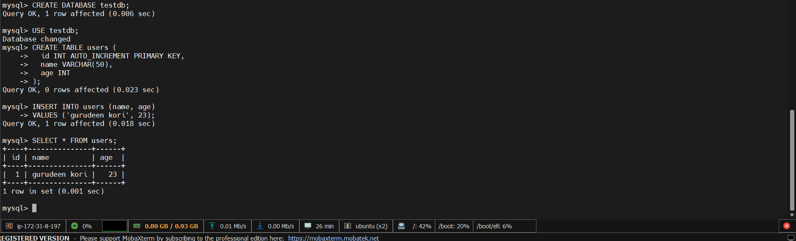
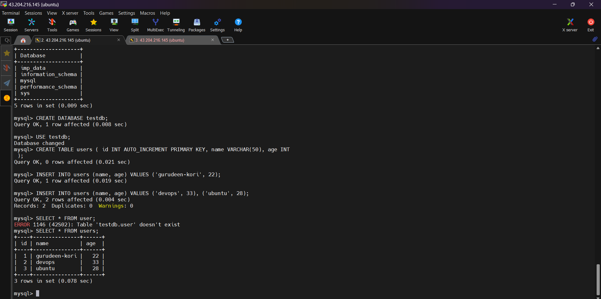
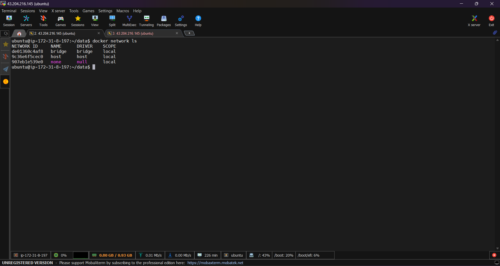
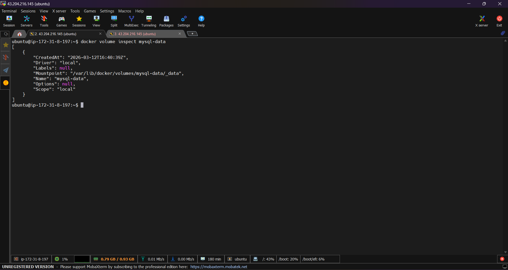
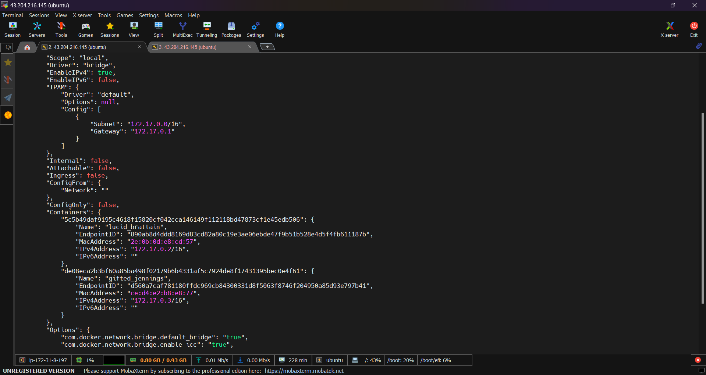
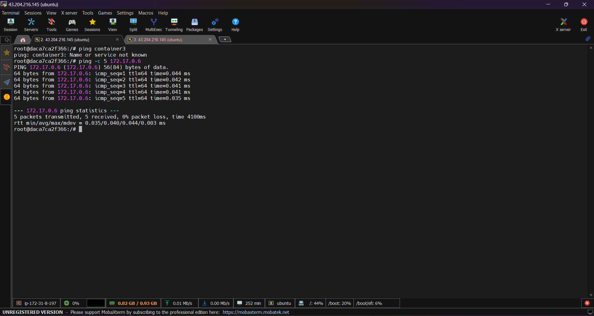
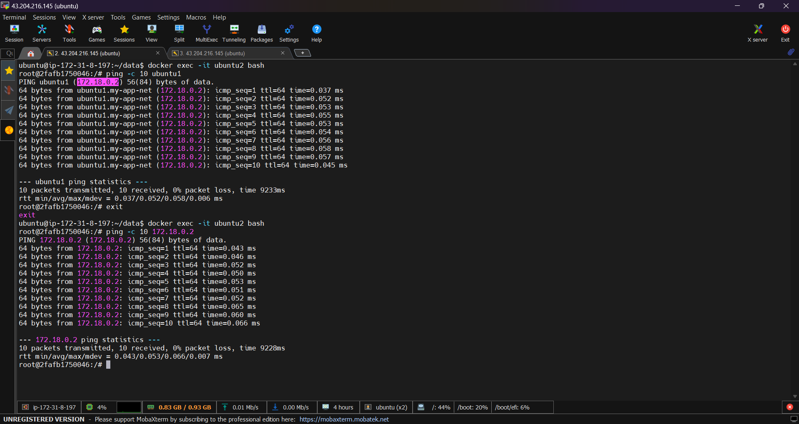

# Task 1: The Problem


## Objective
Demonstrate that data stored inside a container is lost when the container is removed.

---

## Step 1: Run a mySQL Container

Start a MYSQL container using Docker.

```bash
docker run -d -e MYSQL_ROOT_PASSWORD=test mysql
```

Check if the container is running:

```bash
docker ps
```

---

## Step 2: Connect to the Database


## 1. Login to MySQL

If you are running MySQL in a Docker container, connect using:

```bash
docker exec -it fcd mysql 
```
## 1. inside the container
```bash
mysql -u root -p
```
Enter the MySQL root password when prompted.

---

## 2. Create a Database

```sql
CREATE DATABASE testdb;
```

---

## 3. Select the Database

```sql
USE testdb;
```

---

## 4. Create a Table

```sql
CREATE TABLE users (
  id INT AUTO_INCREMENT PRIMARY KEY,
  name VARCHAR(50),
  age INT
);
```

---

## 5. Insert Data into the Table

Insert a single row:

```sql
INSERT INTO users (name, age)
VALUES ('gurudeen-kori', 22);
```

---

## 6. View Inserted Data

```sql
SELECT * FROM users;
```

### Example Output


---

## Step 3: Stop and Remove the Container

Stop the container:

```bash
docker stop fcd && docker rm fcd 
```
---

## Step 4: Run a New Container

Start a new MYSQL container again:

```bash
docker run -d -e MYSQL_ROOT_PASSWORD=test mysql
```

Connect to PostgreSQL again:

```bash
docker exec -it 49d74917ace0 bash
```
```bash
mysql -u root -p 
```
Check existing tables:
```
show databases;
```
# output

---

## Result
You will notice that:
- The `users` table no longer exists.
- All previously inserted data is gone.

---

## Explanation

Containers are **ephemeral**, meaning:

- Data stored inside the container filesystem is temporary.
- When a container is removed, its filesystem and data are also deleted.

To persist data across container restarts or deletions, you need to use **Docker volumes or bind mounts**.

---

## Conclusion

Running a new container **does not preserve data** unless persistent storage (like Docker volumes) is used.

# Task 2: Named Volumes (Docker)

## Objective

Demonstrate how **Docker named volumes** allow database data to persist even after a container is removed.

---

## Step 1: Create a Named Volume

Create a Docker volume to store database data.

```bash
docker volume create mysql-data
```

Verify the volume:

```bash
docker volume ls
```

---

## Step 2: Run MySQL Container with the Volume
Run a MySQL container and attach the named volume.

```bash
docker run -d -v mysql-data:/var/lib/mysql -e MYSQL_ROOT_PASSWORD=test@123 mysql
```

Explanation:

* `-v mysql-data:/var/lib/mysql` → attaches the named volume to the MySQL data directory.

---

## Step 3: Connect to MySQL

```bash
docker exec -it mysql-test mysql -u root -p
```

Enter the password (`test123`).

---

## Step 4: Create Database and Insert Data

```sql
CREATE DATABASE testdb;
USE testdb;

CREATE TABLE users (
  id INT AUTO_INCREMENT PRIMARY KEY,
  name VARCHAR(50)
);
```
```
INSERT INTO users (name) VALUES ('gurudeen-kori'), ('23');
```
```
SELECT * FROM users;
```

Example output:

```
Exit MySQL:
```
```docker 
exit
```

---

## Step 5: Stop and Remove the Container

```bash
docker stop 368 && docker rm 368
```

The container is removed, but the **volume still exists**.

---

## Step 6: Run a New Container with the Same Volume

```bash
docker run -d -v mysql-data:/var/lib/mysql -e MYSQL_ROOT_PASSWORD=test mysql

```

---

## Step 7: Verify the Data

Connect again:

```bash
docker exec -it mysql-test mysql -u root -p
```

Check the database:

```sql
USE testdb;
SELECT * FROM users;
```
# output
You will see the same data (`Alice`, `Bob`) still present.

---

## Step 8: Verify Docker Volumes

List all volumes:

```bash
docker volume ls
```

Inspect the volume:

```bash
docker volume inspect mysql-data
```

This shows details such as mountpoint, creation time, and driver.

---

## Result

✔ The data **remains available** even after deleting the container.

---

## Conclusion

Named volumes store data **outside the container filesystem**, allowing containers to be removed or recreated **without losing important data like databases**.

# Verify:
```bash
docker volume ls
```

```
docker volume inspect mysql-data
```


# Task 3: Bind Mounts

## Objective
Use a **bind mount** to serve a web page from your host machine inside an Nginx container.

---

## Step 1: Create a Folder on Host

```bash
mkdir data
cd data
```

Create a simple `index.html`:

```html
<!DOCTYPE html>
<html>
<head>
    <title>Bind Mount Test</title>
</head>
<body>
    <h1>Hello from Host Bind Mount! 🚀</h1>
    <p>This page is served by Nginx container.</p>
</body>
</html>
```

---

## Step 2: Run Nginx Container with Bind Mount

```bash
docker run -d -p 80:80 -v /home/ubuntu/data:/usr/share/nginx/html nginx
```


---

## Step 3: Access the Web Page

Open your browser:

```
http://43.204.216.145:80
```

You should see your `index.html` content.

---

## Step 4: Edit `index.html` on Host

```bash
vim index.html
```

Change text or heading, save. Refresh the browser — changes appear **immediately**.

---

## Step 5: Notes – Difference Between Named Volume and Bind Mount

| Feature | Named Volume | Bind Mount |
|---------|--------------|------------|
| Location | Managed by Docker (`/var/lib/docker/volumes/...`) | Anywhere on host filesystem |
| Data Persistence | Yes, survives container removal | Yes, but directly tied to host folder |
| Use Case | Storing database or app data | Serving web content, live development |
| Visibility | Not directly visible on host | Fully visible/editable on host |
| Initialization | Empty volume created on first container start | Uses existing host folder contents |

**Key Point:**  
- **Named volumes** are ideal for persistent app data.  
- **Bind mounts** are ideal for development where you want live editing.

---

# Task 4: Docker Networking Basics

## Step 1: List All Docker Networks

```bash
docker network ls
```

Example output:


- `bridge` → default network for containers  
- `host` → uses host network directly  
- `none` → no networking  

---

## Step 2: Inspect the Default Bridge Network

```bash
docker network inspect bridge
```

Example fields:

- `Subnet` → IP range for containers  
- `Gateway` → bridge gateway IP  
- `Containers` → lists containers attached to the network  

---

## Step 3: Run Two Containers on the Default Bridge

```bash
docker run -dit --name container1 ubuntu
docker run -dit --name container2 ubuntu
```

Install ping inside containers (Alpine doesn’t have ping by default):

```bash
docker exec -it container3 bash
apt update && apt install -y iproute2
```

---

### Step 3a: Ping by Name

From `container3`:

```bash
ping container4
```

❌ Result: **fails** — on the default bridge, containers **cannot resolve each other by name**.  

---

### Step 3b: Ping by IP

Get IPs from `docker network inspect bridge` or inside container:

```bash
docker exec container4 sh -c "ip addr show eth0"
# Example: 172.17.0.3
```

From `container3`:

```bash
ping 172.17.0.3
```

✅ Result: **works** — containers can ping each other by IP on the default bridge network.  

---

## Summary

| Feature | Default Bridge Network |
|---------|----------------------|
| Name resolution | ❌ Not available (cannot ping by container name) |
| Communication by IP | ✅ Works |
| Use case | Simple container-to-container communication when IPs are known |
| Alternative | **User-defined bridge network** allows container name resolution |

**Tip:** For easier container-to-container communication by name, use:

```bash
docker network create mynet
docker run --net mynet --name container3 ubuntu
docker run --net mynet --name container4 ubuntu
```

On a **user-defined bridge**, `container1` can ping `container2` by name.  

# Task 5: Custom Networks
## Step 1: Create a User-Defined Network

```bash
docker network create my-app-net
```

- User-defined bridge networks allow **container name resolution**.

---

## Step 2: Run Ubuntu Containers on the Network

```bash
docker run -dit --name ubuntu1 --network my-app-net ubuntu
docker run -dit --name ubuntu2 --network my-app-net ubuntu
```

- `--network my-app-net` attaches the containers to the custom network.

---

## Step 3: Install ping and ip commands

Ubuntu minimal images don’t have `ping` or `ip` by default. Install them:

```bash
docker exec -it ubuntu1 bash
apt update
apt install -y iputils-ping iproute2
exit
```

Repeat for `ubuntu2`:

```bash
docker exec -it ubuntu2 bash
apt update
apt install -y iputils-ping iproute2
exit
```

---

## Step 4: Test Ping by Container Name

```bash
docker exec -it ubuntu1 
ping -c 3 ubuntu2
```

✅ This works because **user-defined bridge networks provide DNS for container names**.

---

## Step 5: Test Ping by IP

1. Find container2 IP:

```bash
docker network inspect my-app-net

```

2. From container1:

```bash
docker exec ubuntu1 
ping -c 10 172.18.0.3
```

✅ Works — containers can communicate by IP as well.

---

## Step 6: Notes

| Feature | Default Bridge | User-Defined Bridge |
|---------|----------------|------------------|
| Ping by name | ❌ Not available | ✅ Works |
| Ping by IP | ✅ Works | ✅ Works |
| Use case | Quick testing | App networks with name resolution |
| Extra setup | None | Create network before running containers |

---

**Tip:** Always install `iputils-ping` and `iproute2` in minimal Ubuntu containers for networking tests.


