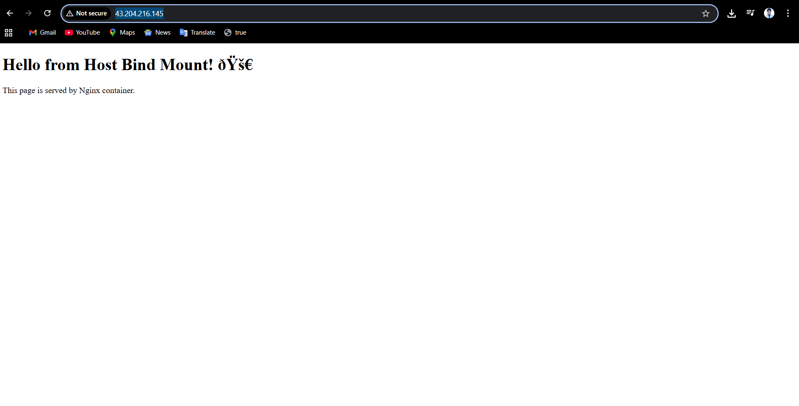
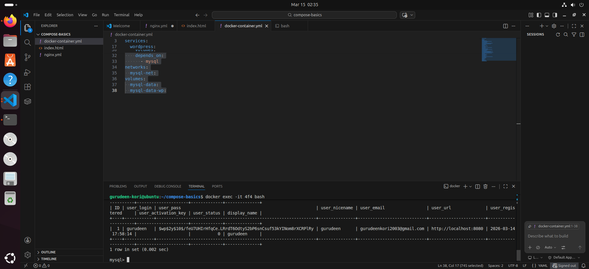

# Task 1: Install & Verify
- Check if Docker Compose is available on your machine
```bash
apt update && apt install docker-compose
```
- Verify the version
 ```bash
 docker compose version
 ```
 
# Task 2: Your First Docker Compose File

## Objective
Create a simple Docker Compose setup that runs a single Nginx container.

Tasks:
- Create a folder named `compose-basics`
- Create a `docker-compose.yml`
- Run an Nginx container
- Access Nginx from the browser
- Stop the container

---

# Step 1: Create Project Folder

Open terminal and run:

```bash
mkdir compose-basics
cd compose-basics
```
# Step 2: Create docker-compose.yml File

Create the file:
```
vim docker-compose.yml
```
```Docker-compose
version: "3"
services:
  nginx:
    image: nginx:alpine
    container_name: nginx-server
    ports:
      - "8080:80"
    volumes:
      - .:/usr/share/nginx/html
    networks:
      - my-network

networks:
  my-network:
  
  ```
#  Step 3: Start the Container

Run the following command:
```
docker compose up
```
Docker will:

- Pull the Nginx image
- Create the container
- Start the container


# Step 4: Access Nginx in Browser

Open browser and go to:
```
http://localhost:8080
```
# output


# Task 3: Two-Container Setup
Write a docker-compose.yml that runs:
```compose
version: "3.8"

services:
  mysql:
    image: mysql
    container_name: mysql-server
    restart: always
    environment:
      MYSQL_ROOT_PASSWORD: test@123
      MYSQL_DATABASE: mysql-db
    networks:
      - mysql-net
    ports:
      - "3306:3306"
    volumes:
      - mysql-data:/var/lib/mysql
  wordpress:
    image: wordpress
    container_name: wordpress-site
    restart: always
    environment:
      WORDPRESS_DB_HOST: mysql:3306
      WORDPRESS_DB_USER: root
      WORDPRESS_DB_PASSWORD: test@123
      WORDPRESS_DB_NAME: mysql-db
    ports:
      - "8080:80"
    networks:
      - mysql-net
    volumes:
      - mysql-data-wp:/var/www/html
    depends_on:
      - mysql
networks:
  mysql-net:
volumes:
  mysql-data:
  mysql-data-wp:
  
 ```
A WordPress container
A MySQL container

## run 
```bash
docker compose -f docker-compose up -d 
```
## output 
# Wordpress container output 


# database container output 


# Verify 
**before docker compose up**
**wordpress**


**mysql**


## after docker compose up 
**wordpress**


**mysql**


# Task 4: Docker Compose Commands Practice

## Objective

Practice important Docker Compose commands for managing services.

You will learn how to: - Start services in detached mode - View running
services - View logs of all services - View logs of a specific service -
Stop services without removing - Remove containers and networks -
Rebuild images after changes

------------------------------------------------------------------------

## 1. Start Services in Detached Mode

Run containers in the background:

``` bash
docker compose up -d
```

Explanation: - `up` → Starts services - `-d` → Detached mode (runs in
background)

------------------------------------------------------------------------

## 2. View Running Services

``` bash
docker compose ps
```

Alternative command:

``` bash
docker ps
```

------------------------------------------------------------------------

## 3. View Logs of All Services

``` bash
docker compose logs
```

Follow logs in real time:

``` bash
docker compose logs -f
```

------------------------------------------------------------------------

## 4. View Logs of a Specific Service

Example: WordPress service

``` bash
docker compose logs wordpress
```

Example: MySQL service

``` bash
docker compose logs db
```

Real-time logs:

``` bash
docker compose logs -f wordpress
```

------------------------------------------------------------------------

## 5. Stop Services Without Removing Containers

``` bash
docker compose stop
```

Start again:

``` bash
docker compose start
```

------------------------------------------------------------------------

## 6. Remove Containers and Networks

``` bash
docker compose down
```

Remove containers + volumes:

``` bash
docker compose down -v
```

------------------------------------------------------------------------

## 7. Rebuild Images After Changes

Rebuild automatically when starting:

``` bash
docker compose up --build
```

Manual rebuild:

``` bash
docker compose build
docker compose up -d
```

------------------------------------------------------------------------

## Common Workflow

``` bash
docker compose up -d
docker compose ps
docker compose logs -f
docker compose stop
docker compose down
```

------------------------------------------------------------------------

## Result

✔ Services started in background\
✔ Logs monitored\
✔ Services stopped and restarted\
✔ Containers removed using compose down\
✔ Images rebuilt when changes made
