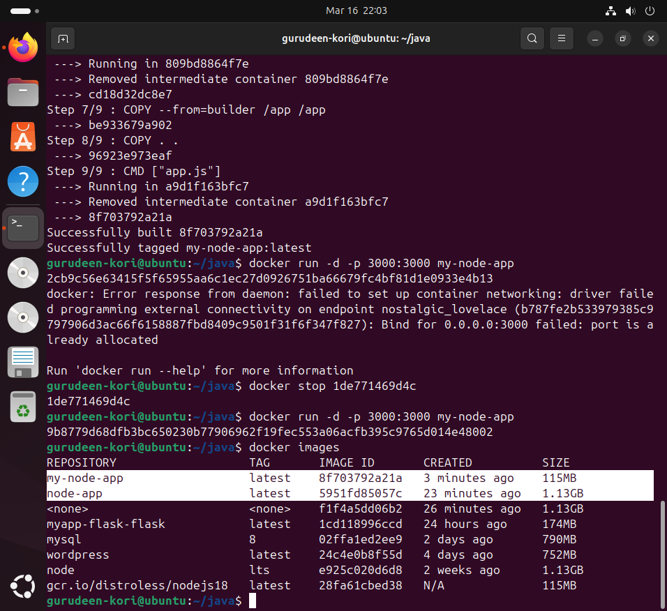
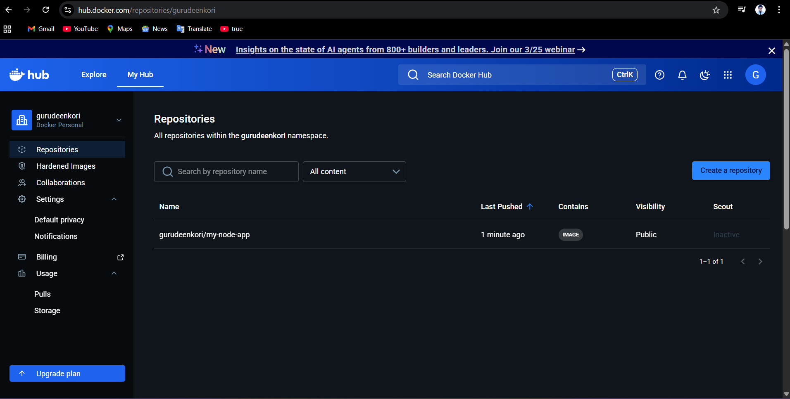

# Task 1: The Problem with Large Images
```
FROM node:lts

WORKDIR /app

COPY . .

RUN npm install

CMD ["node", "app.js"]
```

# output



Task 2: Multi-Stage Build
# base image 
```
node:lts
```
# distroless image 
```
gcr.io/distroless/nodejs18
```
compare size


- **Exclusion of Build-Time Dependencies:** In a single-stage build, compilers, development libraries, and source code are included in the final image. Multi-stage builds leave these heavy tools behind in the initial "builder" stage.
- **Selective Artifact Copying:** Only the final, compiled binary or necessary production files are copied from the builder stage to the final stage using COPY --from=builder.
Use of Minimal Base Images: The final stage can use a lightweight base image (such as alpine, distroless, or slim) that lacks unnecessary utilities like compilers or debugging tools, further reducing the footprint.
**No Unnecessary Intermediate Layers:** Multi-stage builds prevent intermediate layers—created during steps like installing dependencies and then cleaning them up—from being carried into the final image.

# Benefits of this approach:
- Faster deployments: Smaller images are faster to pull, move, and deploy.
- Improved security: Fewer components mean a smaller attack surface.
- Reduced storage: They save significant space on local machines and container registries.
- 

# Task 3: Push to Docker Hub

# Image build check
```
docker images
```
# tag properly image 
```
docker tag my-node-app gurudeenkori/my-node-app:v1
```
# push on docker hub 
```
docker push gurudeenkori/my-node-app:v1
```
# Verify 
```
docker rmi gurudeenkori/my-node-app:v1

#pull on docker hub:

docker pull gurudeenkori/my-node-app:v1
```
# Run :
```
docker run -p 3000:3000 gurudeenkori/my-node-app:v1
```


# commands
```bash
doocker login
docker build -t my-node-app .
docker tag my-node-app gurudeenkori/my-node-app:v1
docker push gurudeenkori/my-node-app:v1
docker pull gurudeenkori/my-node-app:v1

```
Task 4: Docker Hub Repository

#  Pull specific tag vs latest
```
docker pull gurudeenkori/my-node-app:v1


