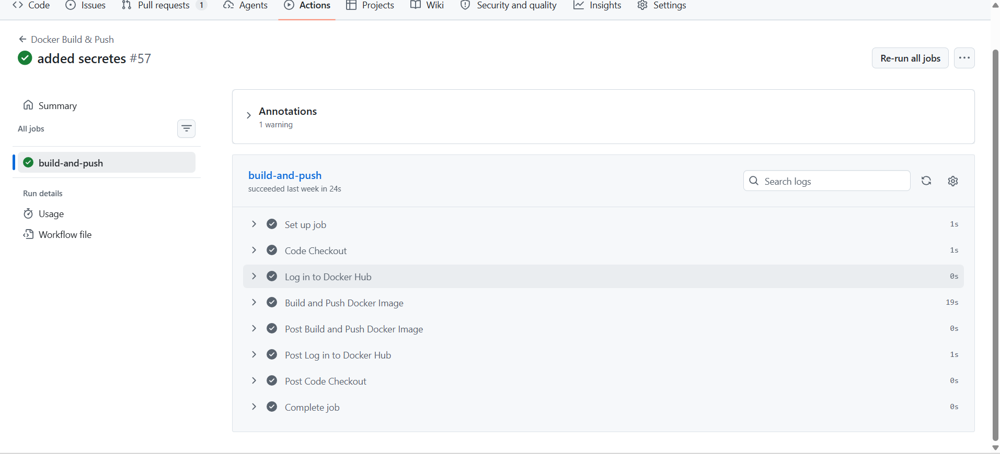

# Day 45 - Docker CI/CD Pipeline

## Workflow YAML

 
name: Docker Build & Push

on:
  push:
    branches: [main]
  workflow_dispatch:

jobs:
  build-and-push:
    runs-on: ubuntu-latest

    steps:
      - name: Code Checkout
        uses: actions/checkout@v4

      - name: Log in to Docker Hub
        uses: docker/login-action@v3
        with:
          username: ${{ vars.DOCKER_USERNAME }}
          password: ${{ secrets.DOCKERHUB_TOKEN }}
          
      - name: Build and Push Docker Image
        uses: docker/build-push-action@v6
        with:
          context: .
          file: .github/workflows/Dockerfile
          push: true
          tags: | 
            ${{ vars.DOCKER_USERNAME }}/github-action-app:${{ github.ref_name }}
            ${{ vars.DOCKER_USERNAME }}/github-action-app:latest
            ${{ vars.DOCKER_USERNAME }}/github-action-app:${{ github.sha}}

## Docker Hub Image
https://hub.docker.com/repository/docker/gurudeenkori/github-action-app/

## Pipeline Screenshot

## Full Journey
Git Push → Running Container Journey:

1. A developer pushes code to the GitHub repository (main branch).
2. The GitHub Actions workflow is automatically triggered.
3. The runner checks out the source code.
4. A Docker image is built using the Dockerfile.
5. The image is tagged with:
   - main
   - sha256:a0e0bf80f53685a209c93e38918dd0e4acce7cc23292b842a752f679297da8c1
6. The workflow logs in to Docker Hub securely using stored secrets.
7. The Docker image is pushed to Docker Hub.

8. On a local machine or server:
   docker pull gurudeenkori/github-action-app:main
   docker run -d -p 5000:5000 gurudeenkori/github-action-app:main

9. The application is now running inside a container.