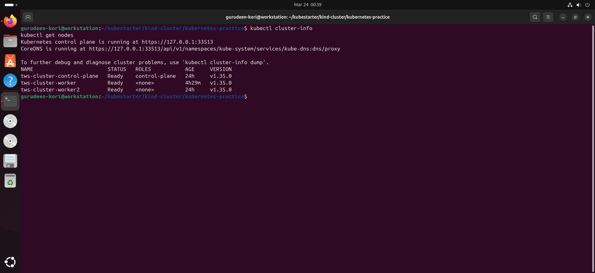

# 🚀 Day 50 – Kubernetes Setup & Architecture

## 📖 1. Kubernetes Story (In My Words)

Kubernetes was created to solve the problem of managing containers at scale, which Docker alone cannot handle efficiently. While Docker helps in running containers, it does not provide features like auto-scaling, self-healing, or cluster management. Kubernetes was developed by Google based on their internal system called Borg. The name "Kubernetes" comes from Greek, meaning "helmsman" or "ship pilot", which represents managing containerized applications like steering a ship.

---

## 🏗️ 2. Kubernetes Architecture (From Memory)

### 🔹 Control Plane (Master Node)

* **API Server**

  * Entry point of the cluster
  * All commands (kubectl) go through it

* **etcd**

  * Key-value database
  * Stores cluster state

* **Scheduler**

  * Decides which node will run a pod

* **Controller Manager**

  * Maintains desired state
  * Ensures actual state matches desired state

---

### 🔹 Worker Node

* **kubelet**

  * Communicates with API Server
  * Manages pods on node

* **kube-proxy**

  * Handles networking
  * Enables pod communication

* **Container Runtime**

  * Runs containers (containerd / CRI-O)

---

## 🔄 What Happens When I Run:

### 👉 `kubectl apply -f pod.yaml`

1. kubectl sends request to API Server
2. API Server validates and stores data in etcd
3. Scheduler assigns pod to a worker node
4. kubelet receives instruction
5. Container runtime starts container
6. Controller ensures pod stays running

---

### ❌ If API Server Goes Down

* Cluster becomes inaccessible
* No new deployments or updates
* Existing apps may still run

---

### ❌ If Worker Node Goes Down

* Pods on that node stop
* Controller recreates pods on another node

---

## 🛠️ 3. Tool Choice

### ✅ I Chose: **kind (Kubernetes in Docker)**

### 💡 Reason:

* Lightweight and fast
* Uses Docker (already installed)
* Best for local practice
* Easy to create/delete clusters

---

## ⚙️ 4. Cluster Setup Commands

```bash
# Create cluster
kind create cluster --name tws-cluster

# Verify
kubectl cluster-info
kubectl get nodes
```

---

## 📊 5. Cluster Exploration

```bash
kubectl cluster-info
kubectl get nodes
kubectl describe node <node-name>
kubectl get namespaces
kubectl get pods -A
kubectl get pods -n kube-system
```

---

## 🧩 6. kube-system Pods & Their Roles

* **etcd**

  * Stores cluster data

* **kube-apiserver**

  * Handles API requests

* **kube-scheduler**

  * Assigns pods to nodes

* **kube-controller-manager**

  * Maintains desired state

* **coredns**

  * DNS for service discovery

* **kube-proxy**

  * Networking for pods

---

## 🔁 7. Cluster Lifecycle Practice

```bash
# Delete cluster
kind delete cluster --name devops-cluster

# Recreate cluster
kind create cluster --name devops-cluster

# Verify
kubectl get nodes
```

---

## ⚙️ 8. kubeconfig Understanding

### 👉 What is kubeconfig?

* Configuration file for kubectl
* Stores cluster details, users, and contexts

### 📍 Location:

```
~/.kube/config
```

---

### Useful Commands:

```bash
kubectl config current-context
kubectl config get-contexts
kubectl config view
```

---


---

## ✅ Key Learnings

* Kubernetes manages containers at scale
* Control Plane manages cluster decisions
* Worker Nodes run actual applications
* kube-system namespace contains core components
* kind is great for local Kubernetes practice

---

